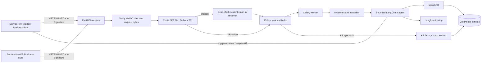

# Architecture

This describes the code and integration surfaces in this checkout. ServiceNow Business Rules execute inside the ServiceNow instance; the JavaScript files here are repository copies, not proof of the deployed instance's current configuration.

## Live incident path

### Event receipt, de-duplication and dispatch

1. The incident Business Rule sends an event ID, incident `sys_id`, number and event type. It filters inactive incidents, unsupported categories, and records already processed or in an AI terminal/in-progress state. The KB rule sends article ID, operation and timestamp for eligible published article changes and deletions.
2. `POST /api/v1/events/servicenow` validates `X-Signature` as HMAC-SHA256 of the raw body before parsing JSON. Missing/invalid signatures are rejected; invalid JSON and missing identifiers also return errors.
3. Redis atomically sets `evt:<identifier>` with `NX` and a default 86,400-second expiry. Duplicate events receive `202` without a task being enqueued.
4. KB payloads route to `sync_kb_article`. For incident payloads, the API attempts a ServiceNow `in_progress` claim synchronously, but logs and continues to enqueue if that claim fails. The Celery incident task then makes a second, mandatory claim before calling the agent. The second claim failure aborts processing.

### Agent and writeback

The worker loads incident fields from ServiceNow and asks a self-hosted vLLM endpoint serving Qwen2.5-1.5B-Instruct to compare next-token log-probabilities for the `true` and `false` labels. Label token IDs are resolved once from that endpoint's tokenizer and cached in the worker process. If the positive label wins, the configured chat LLM masks the fields; the worker reclassifies the cleaned text and fails closed if a credential is still detected. It patches verified, cleaned fields back to ServiceNow before passing them to the agent inside an explicitly untrusted incident-data wrapper. The same classifier-and-mask verification runs on every KB chunk and its string metadata before embedding, caching, or Qdrant upsert, and on every search query before it reaches the embedding provider. Classifier and masking errors stop those paths rather than forwarding unverified text. Existing Qdrant points and embedding-cache entries are not retroactively scrubbed; purge any pre-existing index and rebuild it from sanitized KB articles. `searchKB` embeds the sanitized query and returns the top five dense Qdrant matches; `addWorkNote` is a repeatable tool. Exactly one terminal outcome is intended:

- `suggestAnswer` stores a suggested procedure, cited source IDs, a self-assessed confidence in `[0,1]`, and `human_review_required=true`.
- `requestHR` records an escalation and work note, also requiring human review. Despite its historical name, it is generic human escalation, not an HR system integration.

The agent cannot resolve, close or reassign incidents. Its execution guard limits model iterations (default 5) and the agent entry point attempts to escalate if its budget is exhausted without a terminal tool. Agent exceptions are recorded as a failed task and the worker attempts to persist a recoverable incident state; there is no automatic re-drive workflow.

## Knowledge ingestion and retrieval

- **ServiceNow KB sync:** the Celery sync task fetches an article, splits recognizable HTML sections (Problem, Diagnostic Steps, Resolution, etc.), falls back to Body, applies character-based chunks (default 500 characters with 50 overlap), embeds and upserts into Qdrant. Article deletion removes vectors by `article_id`.
- **Batch KB load:** `uv run python -m barq_support.ingestion.ingest` fetches published KB articles and uses the same chunking/embedding path.
- **PDF load:** `scripts/ingest_pdf.py` is a separate manual CLI. It is not called by webhook processing. PDF chunks can share the collection with ServiceNow KB vectors.
- **Retrieval:** `src/barq_support/retrieval/retriever.py` queries `kb_articles`, dense cosine vectors, top-k 5. There is no relevance score cutoff or reranker; the agent must decide whether evidence is sufficient.
- **Embeddings:** Gemini `gemini-embedding-2`, 3072 dimensions. Changing embedding model/dimensions requires compatible re-ingestion.

## Components and implementation status

| Component | Implementation | Status / caveat |
|---|---|---|
| Incident and KB event rules | `servicenow/scripts/incident.js`, `servicenow/scripts/KB.js` | Source copies only; deployment is in ServiceNow. The required `HmacSha256` Script Include source is absent from this repository. |
| Receiver and signature verification | `src/barq_support/main.py`, `api/events.py`, `security.py` | Implemented; receiver performs a synchronous best-effort incident claim before queuing. |
| De-duplication and routing | `src/barq_support/dedup.py`, `api/events.py` | Redis atomic set with 24-hour TTL. KB event IDs fall back to article ID, which can suppress legitimate further edits/deletion for that article during the TTL. |
| Worker and integration | `src/barq_support/tasks.py`, `worker.py`, `servicenow.py` | Implemented; incident is claimed a second time in the worker. No Celery retry or automated recovery/re-drive workflow is configured. |
| Agent, prompts and tools | `src/barq_support/agent/` | Bounded tool-calling agent and capture-stubbed in the quality evaluation. |
| KB ingestion | `src/barq_support/ingestion/` | Implemented for ServiceNow KB articles; manual PDF path is separate. |
| Evaluation | `evaluation/` | DeepEval harness includes retrieval and agent stages, negative cases and per-case artifacts. Evaluation findings and corpus limits are documented in its report. |

## Operational limitations to keep in mind

- **KB deduplication:** KB event payloads identify events by `article_id` rather than a unique event ID. A second operation on that same article within 24 hours can be acknowledged but skipped.
- **Incident claim:** receiver and worker both call `claim_incident`; the first attempt is best-effort, and queueing proceeds even if it fails.
- **Recovery:** failures can leave the incident `in_progress` with `ai_processed=0`. The repository does not automatically reset or re-drive it.
- **Configuration drift:** ingestion uses `QDRANT_COLLECTION`; retrieval uses the constant `kb_articles`. Keep the configured collection aligned with that fixed value. The agent embedder requires `GEMINI_API_KEY`.
- **No retrieval cutoff:** top five is returned even for weak/adjacent matches, leaving refusal to the model.
- **Human review:** confidence is an LLM self-assessment, not a calibrated probability or retrieval similarity.
- **External state:** this repository does not guarantee that deployed ServiceNow rules/fields or a particular Qdrant corpus match local files. Verify those systems independently.

See the [Run Guide](RUN_GUIDE.md) for setup and the [Decision Log](DECISION_LOG.md) for the rationale and evaluation-related choices.
