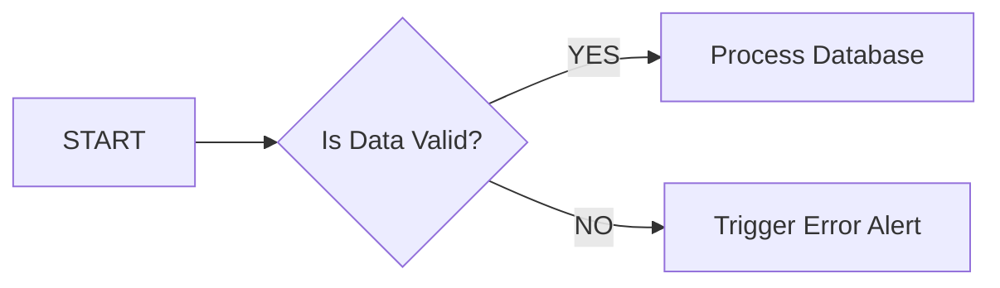

# Extracted Chunks: Advanced_Extraction_Challenges.pdf

### Chunk 1 [text | page 1 | 69674578...]

# Advanced Document Extraction Challenges

## 1. Complex Tables: Nested & Multi-span Headers

---

### Chunk 2 [table | page 1 | b290b4e1...]

| ID | Primary Details: Category A | Primary Details: Category B | Nested Data Challenge |
| --- | --- | --- | --- |
| 001 | Alpha Data | Beta Data | *See nested sub-table below* |
| 002 | Merged Middle Row | Merged Middle Row | Standard Text Here |

---

### Chunk 3 [text | page 1 | 357fdcb1...]

*Note: The following table is nested within row 001 under the "Nested Data Challenge" column.*

---

### Chunk 4 [table | page 1 | 5c891aaa...]

| Sub-Metrics (Nested Colspan) | Sub-Metrics (Nested Colspan) |
| --- | --- |
| Metric X: 45.2 | Metric Y: 99.1 |

---

### Chunk 5 [text | page 1 | 9d75d5c9...]

## 2. Mixed Language (Arabic RTL & English LTR)

هذا النص يختبر قدرة محرك الـ OCR على التعرف على النصوص العربية (Arabic Text) بشكل صحيح من اليمين إلى اليسار.

The system must shape the characters correctly: استخراج البيانات (Data Extraction) يتطلب دقة عالية.

---

### Chunk 6 [table | page 1 | 432ab48d...]

| القيمة (Value) | المفتاح (Key) |
| --- | --- |
| أحمد محمد (Ahmed Mohamed) | الاسم (Name) |

---

### Chunk 7 [text | page 1 | 09f0bdca...]

## 3. Orientation Detection (Rotated Text)

> [Image: A diagram inside a dashed outline displaying text at different rotation angles. At the center is horizontal text reading "Standard Orientation Text". On the left side, rotated 90 degrees upwards, is "Rotated 90 Degrees (Upwards) -". On the right side, rotated 270 degrees downwards, is "Rotated 270 Degrees (Downwards) - محول 270 درجة". At the bottom, inverted at 180 degrees, is "Rotated 180 Degree" and "مقلوب - (Down e)".]

---

### Chunk 8 [text | page 2 | ec56474e...]

## 4. Infographic / Flowchart (For Textual Summarization)

---

### Chunk 9 [diagram | page 2 | 9d0b0310...]

---

### Chunk 10 [text | page 2 | bcd7ffd4...]

Figure 1: Automated Data Validation Workflow

---

