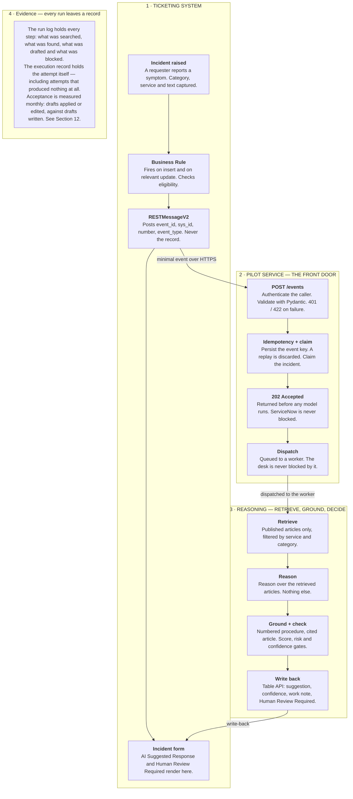
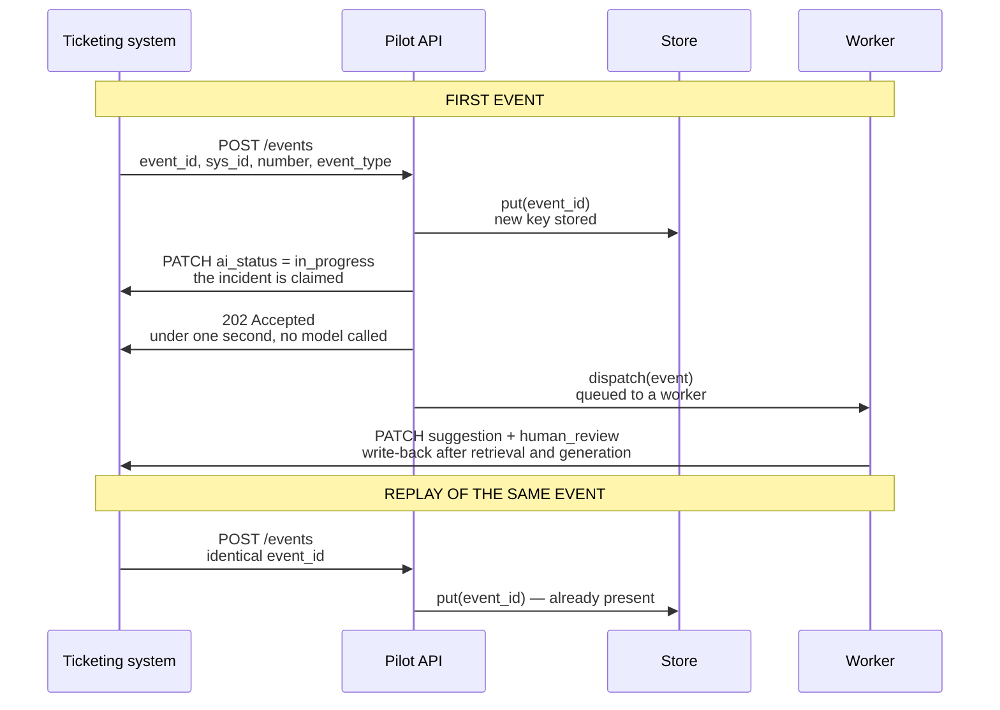
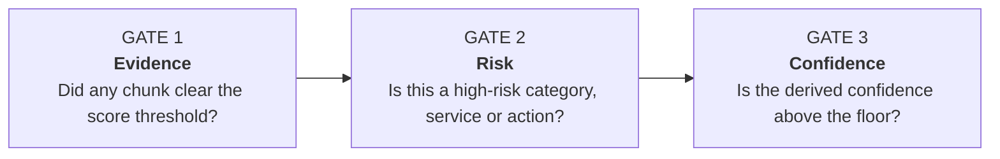
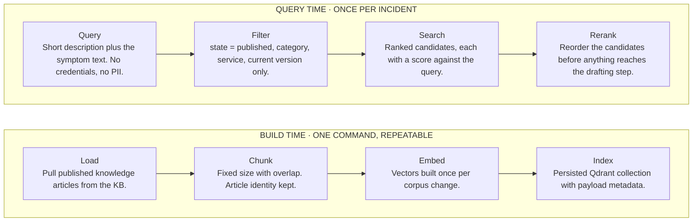

# Extracted Chunks: BARQ_Operations_Manual.pdf (article_id=cdda7be82f9b07502e0e5b707fa4e31f)

### Chunk 1 [text | page_1_text]

> [Image: BARQ SYSTEMS logo featuring blue stylized text "BARQ" above "SYSTEMS"]

IT OPERATIONS DEPARTMENT

# IT Service Desk

## Operations Manual

FY2026 · Internal Document

---

---

### Chunk 2 [table | page_1_table]

| | |
| --- | --- |
| **APPLIES TO** | Service desk analysts, resolver groups, service owners and delivery managers |
| **COVERS** | Incident management, escalation, the knowledge base, problems and known errors, change, and the AI Suggested Response pilot |
| **SITES** | Dubai and Cairo · single queue, follow-the-sun |
| **DOCUMENT OWNER** | Nourhan Abdelrahman — Service Delivery Manager, IT Operations |
| **PUBLISHED** | 11 August 2026 |
| **NEXT REVIEW** | 10 August 2027 |
| **CLASSIFICATION** | **Internal.** Not for distribution outside BARQ Systems or its contracted service partners. |

---

### Chunk 3 [text | page_2_text]

BARQ Systems · IT Service Operations Manual **INTERNAL DOCUMENT**

# Contents

---

### Chunk 4 [text | page_2_text]

Document control .......................................................................................................................................................5
1. About this manual..................................................................................................................................................6
  1.1 Purpose and audience ...................................................................................................................................6

---

### Chunk 5 [text | page_2_text]

1.2 How to find things ..........................................................................................................................................6
  1.3 Conventions ...................................................................................................................................................7

---

### Chunk 6 [text | page_2_text]

2. The service desk .....................................................................................................................................................8
  2.1 Operating model ............................................................................................................................................8

---

### Chunk 7 [text | page_2_text]

2.2 Channels ........................................................................................................................................................8
  2.3 Roles ...............................................................................................................................................................9

---

### Chunk 8 [text | page_2_text]

2.4 Contact routes ................................................................................................................................................9
3. Incident management ........................................................................................................................................ 10
  3.1 The lifecycle ................................................................................................................................................. 10

---

### Chunk 9 [text | page_2_text]

3.2 Incident or request ...................................................................................................................................... 10
  3.3 Priority ......................................................................................................................................................... 10
  3.4 Response and resolution targets .............................................................................................................. 11

---

### Chunk 10 [text | page_2_text]

3.5 Holds, chasing and the no-contact rule...................................................................................................... 11
  3.6 Journalling ................................................................................................................................................... 12
4. Escalation.............................................................................................................................................................. 13

---

### Chunk 11 [text | page_2_text]

4.1 When to escalate......................................................................................................................................... 13
  4.2 The escalation matrix .................................................................................................................................. 13
  4.3 The desk card ............................................................................................................................................... 14

---

### Chunk 12 [text | page_2_text]

5. Service catalogue and supported estate .......................................................................................................... 15
  5.1 How to read this catalogue......................................................................................................................... 15
  5.2 The catalogue .............................................................................................................................................. 15

---

### Chunk 13 [text | page_2_text]

5.3 Criticality definitions .................................................................................................................................. 16
6. Knowledge base articles ..................................................................................................................................... 17
  6.1 Article index................................................................................................................................................. 17

---

### Chunk 14 [text | page_2_text]

6.2 Symptom finder............................................................................................................................................ 17
  6.3 KB0000 — the archived scan...................................................................................................................... 18
  6.4 KB0001 — VPN authentication fails after a password change .................................................................. 18

---

### Chunk 15 [text | page_2_text]

6.5 KB0002 — Outlook shows Disconnected and no mail is delivered .......................................................... 19
  6.6 KB0003 — Mapped shared drive is missing after sign-in........................................................................ 19
  6.7 KB0004 — Print jobs queue but nothing prints........................................................................................ 20

---

### Chunk 16 [text | page_2_text]

6.8 KB0005 — Account is locked after repeated failed sign-ins................................................................... 20
  6.9 KB0006 — Multi-factor authentication after a lost or replaced device .................................................... 21

---

### Chunk 17 [text | page_2_text]

Edition 4.0
2 of 52 .

---

### Chunk 18 [text | page_3_text]

BARQ Systems · IT Service Operations Manual **INTERNAL DOCUMENT**

6.10 KB0007 — Laptop performance degrades after a system update .......................................................... 21

6.11 KB0008 — SAP GUI connection times out with RFC_ERROR_COMMUNICATION ............................... 22

6.12 KB0009 — Wi-Fi drops repeatedly on the 5 GHz corporate network .................................................... 22

---

### Chunk 19 [text | page_3_text]

6.13 KB0010 — Order service connection pool exhaustion ............................................................................... 23

7. Worked incident records ......................................................................................................................................... 25

7.1 What the record looks like .................................................................................................................................. 25

---

### Chunk 20 [text | page_3_text]

7.2 INC0010023 — VPN authentication failure after a password reset ........................................................... 25

7.3 INC0010047 — a fault with no article behind it .......................................................................................... 26

7.4 INC0010064 — three symptoms, one cause ................................................................................................... 27

---

### Chunk 21 [text | page_3_text]

7.5 INC0010052 — escalated without being touched ......................................................................................... 28

8. Problems and known errors .................................................................................................................................... 29

8.1 The difference, and why it matters at the desk ............................................................................................ 29

---

### Chunk 22 [text | page_3_text]

8.2 Open problem register ........................................................................................................................................ 29

8.3 Known error register ............................................................................................................................................ 29

9. Major incident report MIR-2026-03 ....................................................................................................................... 31

---

### Chunk 23 [text | page_3_text]

9.1 Summary .................................................................................................................................................................. 31

9.2 What happened ..................................................................................................................................................... 31

---

### Chunk 24 [text | page_3_text]

9.3 Timeline .................................................................................................................................................................... 31

9.4 The bridge whiteboard ......................................................................................................................................... 32

---

### Chunk 25 [text | page_3_text]

9.5 Root cause ................................................................................................................................................................. 32

9.6 Actions .................................................................................................................................................                      33

---

### Chunk 26 [text | page_3_text]

10. Change management ................................................................................................................................................ 34

10.1 What the desk needs to know .......................................................................................................................... 34

10.2 Pre-approved standard changes ..................................................................................................................... 34

---

### Chunk 27 [text | page_3_text]

10.3 Emergency approval ........................................................................................................................................... 34

10.4 Approval record — CHG0030455 against INC0010052 ........................................................................ 35

11. The AI Suggested Response pilot ........................................................................................................................ 36

---

### Chunk 28 [text | page_3_text]

11.1 What it does, and what it may not do ........................................................................................................... 36

11.2 How a suggestion is produced ......................................................................................................................... 37

11.3 Eligibility ................................................................................................................................................................. 38

---

### Chunk 29 [text | page_3_text]

11.4 Three gates, and what each outcome means to you ................................................................................ 39

11.5 Where the drafts come from ............................................................................................................................ 40

11.6 Safety controls .................................................................................................................................                     41

---

### Chunk 30 [text | page_3_text]

11.7 Configuration .................................................................................................................................                       41

11.8 Reading the run log .................................................................................................................................             42

---

### Chunk 31 [text | page_3_text]

11.9 Integration payload .................................................................................................................                            42

12. Reporting .................................................................................................................................                                   44

---

### Chunk 32 [text | page_3_text]

12.1 The monthly service review .................................................................................................                            44

---
Edition 4.0  
3 of 52

---

### Chunk 33 [text | page_4_text]

BARQ Systems · IT Service Operations Manual
INTERNAL DOCUMENT

12.2 Reporting to service delivery managers............................................................................................... 44

12.3 What is not reported ................................................................................................................................... 45

---

### Chunk 34 [text | page_4_text]

Appendix A · Glossary .......................................................................................................................................... 46

Appendix B · Templates ....................................................................................................................................... 47

B.1 Escalation handover................................................................................................................................... 47

---

### Chunk 35 [text | page_4_text]

B.2 Requester update ......................................................................................................................................... 47

B.3 No-contact resolution................................................................................................................................. 47

B.4 Knowledge article proposal..................................................................................................................... 47

---

### Chunk 36 [text | page_4_text]

Appendix C · Impact and urgency worksheet................................................................................................. 49

Appendix D · Directory ......................................................................................................................................... 50

Appendix E · Identifier index ............................................................................................................................... 51

Edition 4.0
4 of 52 ·

---

### Chunk 37 [text | page_5_text]

BARQ Systems · IT Service Operations Manual
INTERNAL DOCUMENT

# Document control

This manual is a controlled document. The copy of record is the published version in the knowledge base; printed and downloaded copies are uncontrolled and may be superseded without notice. Check the edition and the review date on the cover before relying on any procedure in it.

## Version history

---

### Chunk 38 [table | page_5_table]

| EDITION | DATE | AUTHOR | SUMMARY OF CHANGE | APPROVED BY |
| --- | --- | --- | --- | --- |
| 4.0 | 11 Aug 2026 | H. Moawad, Knowledge Manager | Service catalogue refreshed against the FY2026 estate. Section 11 added for the AI Suggested Response pilot. | N. Abdelrahman |
| 4.0 | 11 Aug 2026 | D. Halim, Problem Manager | Known error register aligned to the problem records raised after MIR-2026-03. | N. Abdelrahman |
| 3.2 | 02 Apr 2026 | H. Moawad, Knowledge Manager | KB0010 revised to version 2 following the 14 March order-processing outage. Version 1 retired. | K. Selim |
| 3.2 | 02 Apr 2026 | O. Sabry, Service Desk Team Lead | Priority matrix corrected: P2 now requires a named service owner on the bridge. | K. Selim |
| 3.1 | 19 Jan 2026 | H. Moawad, Knowledge Manager | Escalation matrix updated for the Identity & Access reorganisation. | N. Abdelrahman |
| 3.0 | 06 Oct 2025 | H. Moawad, Knowledge Manager | Annual review. Manual restructured into twelve sections and the identifier index added. | N. Abdelrahman |

---

### Chunk 39 [text | page_5_text]

## Ownership and review

---

### Chunk 40 [table | page_5_table]

| | |
| --- | --- |
| **Document owner** | Nourhan Abdelrahman — Service Delivery Manager, IT Operations |
| **Author and maintainer** | Hesham Moawad — Knowledge Manager |
| **Classification** | **Internal.** Not for distribution outside BARQ Systems or its contracted service partners. |
| **Review cycle** | Annual, or within 20 working days of any major incident report that names a procedure in this manual |
| **Current edition** | 4.0 · published 11 August 2026 |
| **Next scheduled review** | 10 August 2027 |
| **Feedback** | Raise a request against the *Knowledge — content correction* catalogue item, or comment on the article in the knowledge base |
| **External contribution** | Section 11 was drafted with Sprints (sprints.ai) during the AI Suggested Response pilot |

---

### Chunk 41 [text | page_6_text]

BARQ Systems · IT Service Operations Manual
INTERNAL DOCUMENT

# 1. About this manual

## 1.1 Purpose and audience

This manual is the working reference for everyone who handles an incident at BARQ Systems: service desk analysts on Tier 1, the resolver groups they escalate to, the service owners who accept those escalations, and the delivery managers who report on the result. It states what we have agreed to do, how quickly, and who decides when the agreed answer does not fit.

---

### Chunk 42 [text | page_6_text]

It is deliberately operational. It does not describe architecture, it does not justify tooling choices, and it does not replace vendor documentation. Where a procedure depends on a system whose behaviour we do not control, the procedure says so and names the team who owns the relationship.

---

### Chunk 43 [table | page_6_table]

| | |
| --- | --- |
| **Tier 1 analysts** | Sections 3, 4 and 6 are your working set. Section 7 shows what a well-handled ticket looks like end to end. |
| **Resolver groups** | Sections 4, 5 and 8. Read the known error register before you accept an escalation — half of what reaches you is already documented. |
| **Service owners** | Sections 5, 9 and 10. Your acceptance criteria for a change and your obligations during a major incident are here. |
| **Delivery managers** | Sections 3, 9 and 12. The SLA definitions in 3.4 are the ones reported against in the monthly service review. |
| **New joiners** | Read Sections 1 to 4 in your first week. Do not read Section 6 end to end — it is a reference, and you will search it, not remember it. |

---

### Chunk 44 [text | page_6_text]

## 1.2 How to find things

Everything in this manual carries an identifier that is also searchable in the ticketing system. If you have the identifier, search there first — the record is live and this document is a snapshot.

---

### Chunk 45 [table | page_6_table]

| PREFIX | RECORD TYPE | WHERE IT LIVES |
| --- | --- | --- |
| KB · KB0001 | Knowledge article | Section 6 of this manual, and the published knowledge base. The manual carries the text as at the edition date; the knowledge base carries the current version. |
| INC · INC0010023 | Incident | The ticketing system. Section 7 reproduces a small number of closed incidents as worked examples. |
| PRB · PRB0040012 | Problem | The problem register. Open problems are summarised in Section 8. |
| KE · KE0000034 | Known error | The known error register in Section 8.2. Every known error names its workaround and its permanent fix, if one is planned. |
| CHG · CHG0030455 | Change | The change calendar. Section 10 covers the procedure; the calendar is authoritative for dates. |
| RITM · RITM0010877 | Request item | The service catalogue. Requests are not incidents — see 3.2 for the distinction and why it matters. |
| MIR · MIR-2026-03 | Major incident report | Section 9. One report per declared major incident, published within ten working days. |

---

### Chunk 46 [text | page_6_text]

Edition 4.0
6 of 52

---

### Chunk 47 [text | page_7_text]

Appendix E lists every identifier used in this manual against the section it appears in. If someone quotes you a number and you do not recognise it, start there.

## 1.3 Conventions

---

### Chunk 48 [text | page_7_text]

* **Field labels** appear in Title Case as they render on the form — Assignment group, Business service. Underlying column names appear in code style, as `assignment_group`, and only where a procedure requires you to type one.
* **Times** are Gulf Standard Time (UTC+04) unless a clock is named otherwise. Cairo-based staff should note that the service desk runs on GST, not on local time.

---

### Chunk 49 [text | page_7_text]

* **Working hours** means 08:00 to 18:00 GST, Sunday to Thursday. **Extended hours** and **out of hours** are defined in 2.1 and are not interchangeable.
* **Must**, **should** and **may** carry their ordinary contractual weight. A step marked Must has been agreed with a service owner and skipping it is a deviation to be recorded, not a judgement call.

---

### Chunk 50 [text | page_8_text]

# 2. The service desk

## 2.1 Operating model

The desk runs a follow-the-sun pattern across two locations with a single queue. An analyst in either location can pick up any incident; the shift pattern determines who is expected to, not who is permitted to.

---

### Chunk 51 [table | page_8_table]

```json
[
  {
    "coverage": "Working hours",
    "dubai": {
      "hours_gst": "08:00 – 18:00",
      "analysts": "6"
    },
    "cairo": {
      "hours_gst": "09:00 – 19:00",
      "analysts": "5"
    }
  },
  {
    "coverage": "Extended hours",
    "dubai": {
      "hours_gst": "18:00 – 22:00",
      "analysts": "2"
    },
    "cairo": {
      "hours_gst": "—",
      "analysts": "—"
    }
  },
  {
    "coverage": "Out of hours",
    "dubai": {
      "hours_gst": "on-call",
      "analysts": "1 + escalation"
    },
    "cairo": {
      "hours_gst": "on-call",
      "analysts": "—"
    }
  },
  {
    "coverage": "Friday",
    "dubai": {
      "hours_gst": "on-call",
      "analysts": "1"
    },
    "cairo": {
      "hours_gst": "10:00 – 16:00",
      "analysts": "2"
    }
  },
  {
    "coverage": "Saturday",
    "dubai": {
      "hours_gst": "—",
      "analysts": "—"
    },
    "cairo": {
      "hours_gst": "10:00 – 16:00",
      "analysts": "2"
    }
  }
]
```

---

### Chunk 52 [text | page_8_text]

> **Cairo covers Saturday; Dubai covers Friday**
> 
> The two locations do not observe the same weekend, and the rota is built around that rather than in spite of it. An incident raised on a Friday morning is a Cairo incident by default, and one raised on a Saturday is a Dubai on-call incident only if it is P1 or P2.

## 2.2 Channels

---

### Chunk 53 [table | page_8_table]

| CHANNEL | HOURS | CREATES | NOTES |
| --- | --- | --- | --- |
| **Self-service portal** | 24/7 | Incident or request | Preferred. The requester chooses the category, which is why category is unreliable and is re-checked at triage. |
| **Telephone** | Working + extended | Incident | Analyst raises the record while on the call. Never close a phone incident without a written summary in the journal. |
| **Email to the desk** | 24/7 | Incident | Parsed into an incident with category *inquiry*. Always re-categorise at triage; the parser cannot. |
| **Teams channel** | Working hours | Nothing | Triage and chase only. A conversation is not a ticket. If it turns into work, raise the record and post the number back. |
| **Monitoring alert** | 24/7 | Incident | Raised automatically against the affected service with priority derived from the alert severity. See 3.3. |

---

### Chunk 54 [text | page_9_text]

BARQ Systems · IT Service Operations Manual
INTERNAL DOCUMENT

## 2.3 Roles

---

### Chunk 55 [table | page_9_table]

| Role | Description |
| --- | --- |
| **Tier 1 analyst** | Owns the incident from creation to resolution or handover. Applies documented knowledge, keeps the requester informed, and escalates on the clock rather than on frustration. An analyst may not close an incident they escalated without confirmation from the resolver group. |
| **Team lead** | Owns the queue, not the tickets. Runs triage twice a day, rebalances load, and is the first authority on a priority dispute. Approves any P3 that an analyst wants to raise to P2. |
| **Resolver group** | Accepts escalations within its service scope. May reject an escalation once, with a written reason and a named alternative group. A second rejection goes to the service owner, not back to the desk. |
| **Service owner** | Accountable for the service in Section 5. Approves emergency changes against it, joins the bridge for P1 and P2, and signs off the post-incident review. |
| **Major incident manager** | A rostered role, not a job title. Takes command when a major incident is declared, and holds it until the review is published. During that period their instruction outranks this manual. |
| **Knowledge manager** | Owns Section 6. Publishes, revises and retires articles, and is the only role that may set an article to retired. |

---

### Chunk 56 [text | page_9_text]

## 2.4 Contact routes

The full directory, including out-of-hours numbers, is in Appendix D. The routes below are the ones needed during an incident and are repeated there.

---

### Chunk 57 [table | page_9_table]

| NEED | ROUTE | WHEN |
| --- | --- | --- |
| **Raise or chase an incident** | Portal, then phone | Any time. Chasing by Teams does not update the clock. |
| **Declare a major incident** | Major incident bridge | P1 always. P2 when two or more services are affected. |
| **Reach a resolver group out of hours** | On-call rota, Appendix D | P1 and P2 only. P3 waits for working hours. |
| **Emergency change approval** | Change manager, then service owner | Both are required. Neither alone is sufficient — see 10.3. |
| **Knowledge correction** | Catalogue item *Knowledge — content correction* | Any time. Do not edit a published article directly. |

---

### Chunk 58 [text | page_9_text]

Edition 4.0
9 of 52 ·

---

### Chunk 59 [text | page_10_text]

# 3. Incident management

## 3.1 The lifecycle

An incident is an unplanned interruption to a service, or a reduction in its quality. It moves through six states. Only two of them stop the SLA clock, and knowing which two is most of what an analyst needs to understand about the process.

---

### Chunk 60 [table | page_10_table]

| STATE | VALUE | MEANS | CLOCK | WHO MAY SET IT |
| --- | --- | --- | --- | --- |
| New | 1 | Created, not yet picked up. | Running | Anyone. Set automatically on creation. |
| In Progress | 2 | An analyst or resolver group is working it. | Running | The assignee. |
| On Hold | 3 | Waiting on the requester, a supplier or a scheduled window. | Paused | The assignee, with a reason code. See 3.5. |
| Resolved | 6 | A fix has been applied and the requester has been told. | Stopped | The assignee. |
| Closed | 7 | Resolved and either confirmed or auto-closed after five working days. | Stopped | Automatic, or the requester. |
| Cancelled | 8 | Raised in error, duplicate, or not an incident. | Stopped | Team lead only. |

---

### Chunk 61 [text | page_10_text]

## 3.2 Incident or request

Something broken is an incident. Something wanted is a request. The distinction decides the SLA, the approval path and the reporting line, so it is settled at triage and not later.

---

### Chunk 62 [table | page_10_table]

| INCIDENT | REQUEST |
| --- | --- |
| ▪ “I cannot connect to the VPN since my password reset.”<br>▪ “Outlook says Disconnected and no mail has arrived since 08:00.”<br>▪ “The shared drive that was mapped yesterday is gone.”<br>▪ “The order service is returning 500s.” | ▪ “Please order me a second monitor.”<br>▪ “I need access to the finance folder.”<br>▪ “When will my expense claim be paid?”<br>▪ “Can you install the design suite on my laptop?” |
| Resolution targets in 3.4. No approval required to work it. | Fulfilment targets are set per catalogue item. Most require an approval before any work begins. |

---

### Chunk 63 [text | page_10_text]

Two cases cause most of the argument. **Access that used to work and has stopped** is an incident — something broke. **Access that never existed** is a request, even when the person urgently needs it. And **a question with no fault behind it** is neither: answer it, log it as an inquiry, and do not let it consume an incident slot.

## 3.3 Priority

---

### Chunk 64 [text | page_10_text]

## 3.3 Priority

Priority is derived, not chosen. Impact and urgency are set at triage and the matrix does the rest. An analyst who wants a different priority changes the impact or the urgency and says why in the journal; they do not overwrite the derived value.

---

### Chunk 65 [table | page_11_table]

```json
[
  {
    "impact": "Impact 1 – Enterprise",
    "urgency_1_high": "P1",
    "urgency_2_medium": "P1",
    "urgency_3_low": "P2",
    "scope_description": "Whole service, or a site"
  },
  {
    "impact": "Impact 2 – Department",
    "urgency_1_high": "P1",
    "urgency_2_medium": "P2",
    "urgency_3_low": "P3",
    "scope_description": "A team or a floor"
  },
  {
    "impact": "Impact 3 – Individual",
    "urgency_1_high": "P2",
    "urgency_2_medium": "P3",
    "urgency_3_low": "P4",
    "scope_description": "One person"
  }
]
```

---

### Chunk 66 [text | page_11_text]

*A monitoring alert sets impact from the affected service's criticality in Section 5, and urgency from the alert severity. An analyst may lower a derived P1 only with the team lead's agreement, recorded in the journal.*

## 3.4 Response and resolution targets

The clock starts when the incident is created, not when it is picked up. It pauses on hold and stops on resolved. Targets are measured against working hours for P3 and P4, and against elapsed time for P1 and P2.

---

### Chunk 67 [table | page_11_table]

| PRIORITY | RESPONSE | RESOLUTION | UPDATE CADENCE | CLOCK BASIS |
| --- | --- | --- | --- | --- |
| P1 | 15 minutes | 4 hours | Every 30 minutes | Elapsed, 24/7 |
| P2 | 30 minutes | 8 hours | Every 2 hours | Elapsed, 24/7 |
| P3 | 4 working hours | 3 working days | Daily | Working hours |
| P4 | 1 working day | 5 working days | On change of state | Working hours |

---

### Chunk 68 [text | page_11_text]

* **Response** means a human has read the incident and written something in the journal that is specific to it. An auto-acknowledgement is not a response and does not stop the response clock.
* **Resolution** means the service is working again for the requester, confirmed by the requester where they are reachable. A workaround counts as a resolution if the requester can work; the underlying fault then becomes a problem record under Section 8.

---

### Chunk 69 [text | page_11_text]

* **Breach** is recorded automatically and cannot be edited. If a target was missed for a reason outside our control, that reason belongs in the journal and in the monthly service review, not in an adjustment to the record.

---

### Chunk 70 [text | page_11_text]

## 3.5 Holds, chasing and the no-contact rule

---

### Chunk 71 [table | page_11_table]

| REASON CODE | MAX HOLD | WHAT MUST HAPPEN BEFORE AND AFTER |
| --- | --- | --- |
| `awaiting_user` | 5 working days | Two chases at least one working day apart, both recorded. After the second chase with no reply, resolve with the no-contact resolution code and tell the requester how to reopen. |
| `awaiting_supplier` | Per contract | The supplier reference goes in the journal. A hold with no supplier reference is not a supplier hold. |
| `awaiting_change` | To the window | The CHG number goes in the journal. The hold is released when the change closes, not when it is approved. |
| `awaiting_parts` | 10 working days | Expected date recorded and updated weekly. Beyond ten days, raise a request instead and resolve the incident. |
| `scheduled_with_user` | To the appointment | Date and time agreed with the requester in writing. Missing an agreed appointment is a breach even when the clock was paused. |

---

### Chunk 72 [text | page_12_text]

BARQ Systems · IT Service Operations Manual
INTERNAL DOCUMENT

## 3.6 Journalling

The journal is the record. Six months from now, an auditor, a service owner or a colleague picking the ticket up will have nothing else. Two fields, and they are not interchangeable.

---

### Chunk 73 [table | page_12_table]

| WORK NOTES · INTERNAL | ADDITIONAL COMMENTS · THE REQUESTER SEES THESE |
| :--- | :--- |
| ▪ What you checked and what you found<br>▪ Commands run and their output<br>▪ Why you ruled a cause out<br>▪ Which article you applied, by number<br>▪ Who you spoke to and what they said | ▪ What you are doing, in the requester's language<br>▪ What you need from them, and by when<br>▪ What changed and whether they need to act<br>▪ Never: internal names, host names, colleagues' opinions, or the phrase “as per the KB” |

---

### Chunk 74 [text | page_12_text]

> ### Write the article number, every time
> 
> “Applied KB0001, cleared the cached credential, confirmed connection” takes four seconds longer to type than “fixed” and is the difference between a knowledge base we can measure and one we cannot. Article usage is reported monthly in Section 12, and it is the only evidence we have for which articles deserve to survive the next review.

Edition 4.0
12 of 52

---

### Chunk 75 [text | page_13_text]

# 4. Escalation

## 4.1 When to escalate

Escalate on the clock, not on frustration. An incident is escalated when the analyst has exhausted the documented knowledge for its category and the next response target is inside the next hour — whichever comes first. Escalating earlier is not a failure; holding a ticket past its target because you nearly have it is.

---

### Chunk 76 [table | page_13_table]

| PRIORITY | ESCALATE IF UNRESOLVED AFTER | TO | AND ALSO |
| --- | --- | --- | --- |
| **P1** | 15 minutes, or immediately if the cause is unknown | Resolver group **and** the major incident bridge | Service owner paged. Bridge stays open until the service is restored. |
| **P2** | 1 hour | Resolver group | Team lead informed. Service owner informed if two or more services are involved. |
| **P3** | 1 working day | Resolver group | Nothing further unless the group rejects the escalation. |
| **P4** | 3 working days | Resolver group, or convert to a request | Check first that it is not a request in disguise — see 3.2. |

---

### Chunk 77 [text | page_13_text]

## 4.2 The escalation matrix

Grouped by the service area that owns the escalation. The first line is the standing route; the second is who takes it if the first does not acknowledge inside the acknowledgement window.

---

### Chunk 78 [table | page_13_table]

| AREA | TRIGGER | FIRST ROUTE | IF NO ACK IN 15 MIN |
| --- | --- | --- | --- |
| Network | VPN, remote access, site links | Network Operations | NetOps duty lead |
| Network | Corporate Wi-Fi, roaming, coverage | Network Operations | NetOps duty lead |
| Network | Firewall or segmentation change | Network Security | Head of Infrastructure |
| Identity | Lockouts, password policy, directory | Identity & Access | IAM duty lead |
| Identity | MFA reset or device re-enrolment | Identity & Access | IAM duty lead |
| Identity | Suspected compromise | **Security Operations, immediately** | CISO on-call — do not wait 15 minutes |
| Applications | SAP availability or connectivity | SAP Basis | SAP service owner |
| Applications | Order processing and fulfilment | Platform Engineering | Head of Platform Engineering |
| Applications | Mail flow and collaboration | Collaboration Services | Collaboration duty lead |
| Endpoint | Laptop, desktop, peripherals | Endpoint Engineering | Endpoint duty lead |
| Endpoint | Print and reprographics | Print Services | Facilities duty manager |

---

### Chunk 79 [text | page_14_text]

> ### A rejected escalation comes back once, and only once
>
> A resolver group may return an escalation with a written reason and a named alternative group. The analyst routes it to that group. If the second group also rejects it, the incident goes to the service owner listed in Section 5 — not back to the desk, and not around the loop again. Two rejections is a routing problem, and routing problems are owned above the desk.

## 4.3 The desk card

---

### Chunk 80 [text | page_14_text]

## 4.3 The desk card

The card below is laminated at every desk position and pinned in the Cairo operations room. It is reproduced here because it is the version people actually follow, and because it is reissued whenever 4.1 or 4.2 changes.

### Two columns, one figure, one footnote

The webhook returns 202 Accepted before retrieval or generation has run. This is not an optimisation; it is the contract.

---

### Chunk 81 [text | page_14_text]

ServiceNow's outbound call is synchronous and holds a worker thread while it waits. Retrieval plus generation takes seconds to tens of seconds. A webhook that waited would exhaust the platform's outbound capacity under any realistic burst, slow the instance for every user, and time out anyway.

202 means the service has taken responsibility for the event. That promise is only real because the idempotency key was persisted before the reply was sent.

---

### Chunk 82 [text | page_14_text]

Answering 202 and then failing to store the key means the event can be replayed into a second suggestion, which is the exact failure the status code was meant to rule out.¹

#### Order of operations

---

### Chunk 83 [diagram | page_14_diagram]

```mermaid
flowchart LR
    %% Summary: Order of operations mapping sequence flow between return 202, dispatch, claim incident, claim key, validate, and authenticate.
    %% Key Outcome: Step 4 (claim incident) is the only step that writes to ServiceNow on the request path.
    authenticate["authenticate"] <-- validate["validate"] <-- claim_key["claim key"] <-- claim_incident["claim incident"] <-- dispatch["dispatch"] <-- return_202["return 202"]
```

---

### Chunk 84 [text | page_14_text]

Only the fourth step writes to ServiceNow on the request path.

---
¹ See KB-12 for the atomic claim statement.

*The escalation and acceptance card, issue 4. Reissued with every edition of this manual.*

---

### Chunk 85 [text | page_15_text]

# 5. Service catalogue and supported estate

## 5.1 How to read this catalogue

Each service carries a criticality, a service owner, a support window and the resolver group that owns incidents against it. Criticality feeds the impact column of the priority matrix in 3.3, so changing it is a governance decision and not a desk decision.

---

### Chunk 86 [text | page_15_text]

Support windows are stated in Gulf Standard Time and follow the desk pattern in 2.1¹. A service marked **24/7** is covered by the on-call rota out of hours for P1 and P2 only; P3 and P4 against a 24/7 service still wait for working hours².

## 5.2 The catalogue

---

### Chunk 87 [table | page_15_table]

```json
[
  {
    "service": "order-processing",
    "criticality": "Tier 1",
    "ownership_and_window": {
      "owner": "K. Selim",
      "group": "Platform Eng",
      "window": "24/7"
    },
    "notes": "Revenue-bearing. Any P1 goes straight to the bridge. Remediation is change-controlled — see KB0010 and CHG0030455."
  },
  {
    "service": "identity",
    "criticality": "Tier 1",
    "ownership_and_window": {
      "owner": "N. Abdelrahman",
      "group": "Identity & Access",
      "window": "24/7"
    },
    "notes": "Underpins every other service. A lockout here presents as a fault in three or four services at once — see 7.4."
  },
  {
    "service": "sap-erp",
    "criticality": "Tier 1",
    "ownership_and_window": {
      "owner": "K. Selim",
      "group": "SAP Basis",
      "window": "06:00-22:00"
    },
    "notes": "Not reachable from the internet. Confirm VPN before troubleshooting anything else. KE0000034 applies."
  },
  {
    "service": "corporate-email",
    "criticality": "Tier 2",
    "ownership_and_window": {
      "owner": "O. Sabry",
      "group": "Collaboration",
      "window": "24/7"
    },
    "notes": "Distinguish a single-user fault from a service event before applying any per-user fix. KB0002."
  },
  {
    "service": "corporate-vpn",
    "criticality": "Tier 2",
    "ownership_and_window": {
      "owner": "L. Haddad",
      "group": "Network Ops",
      "window": "24/7"
    },
    "notes": "Highest article usage on the desk. KB0001 alone accounts for roughly one in twenty incidents."
  }
]
```

---

### Chunk 88 [text | page_15_text]

¹Gulf Standard Time, UTC+04. Cairo staff should note that the desk runs on GST and not on local time — see 1.3.
²A P3 raised against a 24/7 service at 02:00 is picked up when the desk opens. Out-of-hours cover exists for restoration, not for convenience.

---

### Chunk 89 [table | page_16_table]

```json
[
  {
    "service": "file-services",
    "tier": "Tier 2",
    "details": {
      "Owner": "L. Haddad",
      "Group": "Infrastructure",
      "Window": "Working"
    },
    "notes": "Permission changes never happen from an incident. Raise the access request — 3.2 and KB0003."
  },
  {
    "service": "corporate-wifi",
    "tier": "Tier 3",
    "details": {
      "Owner": "L. Haddad",
      "Group": "Network Ops",
      "Window": "Working"
    },
    "notes": "Multiple reports in one area are an infrastructure fault, not several endpoint faults. PRB0040021."
  },
  {
    "service": "endpoint",
    "tier": "Tier 3",
    "details": {
      "Owner": "D. Halim",
      "Group": "Endpoint Eng",
      "Window": "Working"
    },
    "notes": "Post-update degradation is expected for 24 hours. Do not act inside that window — KB0007."
  },
  {
    "service": "print-services",
    "tier": "Tier 4",
    "details": {
      "Owner": "O. Sabry",
      "Group": "Print Services",
      "Window": "Working"
    },
    "notes": "Mechanical faults are a facilities matter and are outside the knowledge base. KB0004 covers queues only."
  }
]
```

---

### Chunk 90 [text | page_16_text]

## 5.3 Criticality definitions

---

### Chunk 91 [table | page_16_table]

| TIER | MEANING | CONSEQUENCES |
| --- | --- | --- |
| **Tier 1** | Revenue-bearing, or underpins every other service. | Impact 1 by default. Emergency change route available. Service owner joins every P1 and P2 bridge. |
| **Tier 2** | Enterprise-wide productivity. | Impact 1 when the whole service is down, Impact 2 when a department is affected. |
| **Tier 3** | Departmental or site-level productivity. | Impact 2 at most, unless a site is entirely without the service. |
| **Tier 4** | Convenience. A documented manual workaround exists. | Impact 3 unless several teams are blocked simultaneously. |

---

### Chunk 92 [text | page_17_text]

# 6. Knowledge base articles

*Nine published articles and one retired revision, reproduced as at edition 4.0. The knowledge base is authoritative; this section is a snapshot for offline and audit use.*

## 6.1 Article index

The table below crosses two pages. It is the fastest route from a reported symptom to an article number, and it is the one part of this section worth skimming end to end.

---

### Chunk 93 [table | page_17_table]

| ARTICLE | REPORTED AS | SERVICE | CATEGORY | OWNER |
| --- | --- | --- | --- | --- |
| KB0001 | “VPN says authentication failed since my password reset” | corporate-vpn | network | Network Ops |
| KB0002 | “Outlook is Disconnected and no mail is arriving” | corporate-email | software | Collaboration |
| KB0003 | “My mapped drive has disappeared since I logged in” | file-services | network | Infrastructure |
| KB0004 | “Jobs queue up and nothing comes out of the printer” | print-services | hardware | Print Services |
| KB0005 | “I am locked out and nothing lets me sign in” | identity | inquiry | Identity & Access |
| KB0006 | “I changed my phone and MFA no longer works” | identity | inquiry | Identity & Access |
| KB0007 | “My laptop has been slow since the update” | endpoint | hardware | Endpoint Eng |
| KB0008 | “SAP times out with RFC_ERROR_COMMUNICATION” | sap-erp | software | SAP Basis |
| KB0009 | “Wi-Fi keeps dropping on the 5 GHz network” | corporate-wifi | network | Network Ops |
| KB0010 v2 | “Order service is returning 500s under load” | order-processing | software | Platform Eng |
| KB0010 v1 | *Retired 02 Apr 2026 — do not apply. See 6.12.* | order-processing | software | Platform Eng |

---

### Chunk 94 [text | page_17_text]

## 6.2 Symptom finder

Where the reported words do not match an article title, work from the pattern instead.

### Started after a change
A password reset, a phone replacement, a Windows update or a new starter's first login. Check KB0001, KB0005, KB0006 and KB0007 before anything else.

### Several services at once
Almost always identity, not the services themselves. Go to KB0005 first and confirm the account state before troubleshooting any individual application.

---

### Chunk 95 [text | page_17_text]

### Only in one place
A location-bound fault is infrastructure. KB0009 for wireless; otherwise raise to Network Operations with the location and the times.

---

### Chunk 96 [text | page_18_text]

## 6.3 KB0005 — the archived scan

Articles predating the 2025 migration exist as scans of the printed originals, signed off by the reviewer of the day. The scan is retained for audit; the published text in 6.8 is what you follow.

---

### Chunk 97 [text | page_18_text]

> [Image: Scanned document titled "RUNBOOK — ACCOUNT LOCKOUT", KB0005 · version 4 · identity. Text contains sections: SYMPTOM: The user cannot sign in to any corporate system. Errors mention a locked or disabled account. Often follows a password change, and often presents as several services failing at once. CAUSE: The lockout policy triggers after a threshold of failed attempts. A cached credential on any device can retry an old password silently and lock the account repeatedly. RESOLUTION: 1.

---

### Chunk 98 [text | page_18_text]

and lock the account repeatedly. RESOLUTION: 1. Verify the user's identity. This step is mandatory. 2. Unlock the account in the identity console. 3. Sign out of the corporate mail profile on the mobile device. 4. Clear cached credentials on the laptop, including VPN. 5. Confirm access to two different services before closing. ESCALATION: Repeated lockouts with no identifiable source go to the Identity team. Never disable the lockout policy for an individual user. REVIEWED BY: H. Moawad, DATE:

---

### Chunk 99 [text | page_18_text]

an individual user. REVIEWED BY: H. Moawad, DATE: 11/04/2026.]

---

### Chunk 100 [text | page_18_text]

*KB0005 as it existed before the 2025 migration. Retained for audit only — the current text is in 6.8.*

## 6.4 KB0001 — VPN authentication fails after a password change

---

### Chunk 101 [table | page_18_table]

```json
[
  {
    "KB Article": "KB0001",
    "Title": "VPN AUTHENTICATION FAILS AFTER A PASSWORD CHANGE",
    "State": "Published",
    "Version": "2",
    "Service": "corporate-vpn",
    "Category": "network",
    "Owner": "Network Operations",
    "Author": "L. Haddad",
    "Reviewed": "11 Apr 2026",
    "Uses, 12 mo": "1,284",
    "Related": "PRB0040012, INC0010023"
  }
]
```

---

### Chunk 102 [text | page_18_text]

**Symptom.** The user can reach the internet but the VPN client reports an authentication failure. It began after a password reset. The client may report “invalid credentials” even when the new password is entered correctly.

**Cause.** The VPN client caches the previous credential in the operating system credential store. The cached entry is presented before the newly typed password, so the directory rejects it. Repeated attempts can lock the account (see KB0005).

**Resolution.**

---

### Chunk 103 [text | page_18_text]

**Resolution.**

1. Confirm with the user that they changed their password within the last 24 hours.
2. Ask the user to sign out of the VPN client completely, including the system tray icon.
3. Clear the cached credential for the VPN profile from the credential store.

---

### Chunk 104 [text | page_19_text]

4. Reconnect using the new password.
5. If authentication still fails, check whether the account is locked in the identity console before escalating.

**Escalation.** If the account is not locked and the new password works elsewhere, escalate to the Network team with the client log.

## 6.5 KB0002 — Outlook shows Disconnected and no mail is delivered

---

### Chunk 105 [table | page_19_table]

| KB0002 | OUTLOOK SHOWS DISCONNECTED AND NO MAIL IS DELIVERED | | |
| --- | --- | --- | --- |
| **State** | Published | **Version** | 3 |
| **Service** | `corporate-email` | **Category** | software |
| **Owner** | Collaboration Services | **Author** | O. Sabry |
| **Reviewed** | 02 Feb 2026 | **Uses, 12 mo** | 947 · Related INC0010024 |

---

### Chunk 106 [text | page_19_text]

**Symptom.** The mail client displays Disconnected or Trying to connect. No new mail arrives. Webmail may still work, or may not.

**Cause.** Two distinct causes present identically: a single-user profile or cached-mode corruption, and a service-wide mail outage. Distinguishing them is the first step, not an afterthought.

**Resolution.**

---

### Chunk 107 [text | page_19_text]

**Resolution.**

1. Ask whether colleagues are affected. If more than one user in the same area is affected, treat it as a service event and stop; do not apply per-user fixes to a platform outage.
2. Check whether webmail works for this user. If webmail works, the fault is client-side.
3. For a client-side fault, close the client fully and reopen it.
4. If it still fails, recreate the mail profile and allow the cache to rebuild.
5. Confirm mail flow before closing.

---

### Chunk 108 [text | page_19_text]

**Escalation.** If multiple users are affected, raise a major incident against the corporate-email service. Do not resolve individual incidents until the service event is closed.

## 6.6 KB0003 — Mapped shared drive is missing after sign-in

---

### Chunk 109 [table | page_19_table]

| KB0003 | MAPPED SHARED DRIVE IS MISSING AFTER SIGN-IN | | |
| --- | --- | --- | --- |
| **State** | Published | **Version** | 2 |
| **Service** | `file-services` | **Category** | network |
| **Owner** | Infrastructure | **Author** | L. Haddad |
| **Reviewed** | 19 Jan 2026 | **Uses, 12 mo** | 612 · Related INC0010025 |

---

### Chunk 110 [text | page_19_text]

**Symptom.** A previously available network drive letter is absent after signing in. Other drives may still be present. Browsing to the server path directly may work.

**Cause.** The mapping script runs before the network is ready, or the user has been removed from the group that grants access to the share. These require different fixes, so establish which one applies before acting.

**Resolution.**

---

### Chunk 111 [text | page_19_text]

**Resolution.**

1. Ask the user to browse to the server path directly. If it opens, the share and the permissions are fine and the fault is in the mapping.

---

### Chunk 112 [text | page_20_text]

2. If the path opens, re-run the mapping script, or remap the drive with reconnect-at-sign-in enabled.
3. If the path is refused, check the user's group membership against the share's access group.
4. If group membership is missing, raise an access request. Do not modify group membership from this incident.
5. Confirm the drive is present after a fresh sign-in before closing.

---

### Chunk 113 [text | page_20_text]

**Escalation.** Permission changes go through the access request process and are never applied directly from an incident.

## 6.7 KB0004 — Print jobs queue but nothing prints

---

### Chunk 114 [table | page_20_table]

| KB0004 | PRINT JOBS QUEUE BUT NOTHING PRINTS | | |
| --- | --- | --- | --- |
| State | Published | Version | 1 |
| Service | `print-services` | Category | hardware |
| Owner | Print Services | Author | O. Sabry |
| Reviewed | 06 Oct 2025 | Uses, 12 mo | 1,530 · **Related** INC0010026, INC0010047 |

---

### Chunk 115 [text | page_20_text]

**Symptom.** Documents accumulate in the print queue. The printer shows ready and reports no error. Cancelling a job leaves it stuck as Deleting.

**Cause.** The local print spooler service has stalled, leaving orphaned job files that block the queue.

---

### Chunk 116 [text | page_20_text]

**Resolution.**
1. Confirm the printer is online and shows no physical error, and that paper and toner are present.
2. Stop the print spooler service on the affected machine.
3. Delete the queued job files from the spooler directory.
4. Start the print spooler service again.
5. Print a test page and confirm it completes.

---

### Chunk 117 [text | page_20_text]

**Escalation.** If the queue stalls again within an hour, or several users on the same printer are affected, escalate to Print Services — the fault is likely on the print server rather than the client.

## 6.8 KB0005 — Account is locked after repeated failed sign-ins

---

### Chunk 118 [table | page_20_table]

| KB0005 | ACCOUNT IS LOCKED AFTER REPEATED FAILED SIGN-INS | | |
| --- | --- | --- | --- |
| State | Published | Version | 4 |
| Service | `identity` | Category | inquiry |
| Owner | Identity & Access | Author | H. Moawad |
| Reviewed | 11 Apr 2026 | Uses, 12 mo | 2,109 · **Related** PRB0040012, INC0010027 |

---

### Chunk 119 [text | page_20_text]

**Symptom.** The user cannot sign in to any corporate system. Errors mention a locked or disabled account. Often follows a password change, and often presents as several services failing at once.

**Cause.** The lockout policy triggers after a threshold of failed attempts. A cached credential on any device — a phone mail profile, a VPN client, a mapped drive — can retry an old password silently and lock the account repeatedly, including immediately after each unlock.

---

### Chunk 120 [text | page_20_text]

**Resolution.**
1. Verify the user's identity following the identity verification procedure. This step is mandatory and is never skipped.
2. Unlock the account in the identity console.

---

### Chunk 121 [text | page_21_text]

3. Ask the user to sign out of the corporate mail profile on their mobile device, which is the most common source of a silent retry.
4. Clear cached credentials on the laptop, including VPN and mapped drives.
5. Ask the user to sign in again and confirm access to two different services.
6. If the account locks again within minutes, a device is still retrying an old credential; identify it from the lockout source before unlocking a third time.

---

### Chunk 122 [text | page_21_text]

**Escalation.** Repeated lockouts with no identifiable source go to the Identity team. Never disable the lockout policy for an individual user.

## 6.9 KB0006 — Multi-factor authentication after a lost or replaced device

---

### Chunk 123 [table | page_21_table]

| KB0006 | MULTI-FACTOR AUTHENTICATION AFTER A LOST OR REPLACED DEVICE | | |
| --- | --- | --- | --- |
| State | Published | Version | 3 |
| Service | identity | Category | inquiry |
| Owner | Identity & Access | Author | H. Moawad |
| Reviewed | 11 Apr 2026 | Uses, 12 mo | 438 · Related RITM0010877, INC0010028 |

---

### Chunk 124 [text | page_21_text]

**Symptom.** The user has a new phone, or has lost the previous one, and can no longer approve sign-in prompts or generate codes.

**Cause.** The authenticator registration is bound to the previous device and does not transfer with a phone migration.

---

### Chunk 125 [text | page_21_text]

**Resolution.**
1. Verify the user's identity following the enhanced verification procedure for MFA resets. This is stricter than standard verification and must not be shortened.
2. Confirm whether the previous device is lost or simply replaced. A lost device requires the registration to be revoked, not just re-enrolled.
3. Raise the MFA reset request through the identity workflow. It requires approval; a service desk agent cannot complete it alone.

---

### Chunk 126 [text | page_21_text]

4. Once approved, guide the user through enrolling the new device.
5. Confirm a successful sign-in with the new factor before closing.

---

### Chunk 127 [text | page_21_text]

**Escalation.** An MFA reset is a high-risk identity action. It always requires the approval step, and any suspicion of compromise goes to Security immediately.

## 6.10 KB0007 — Laptop performance degrades after a system update

---

### Chunk 128 [table | page_21_table]

| KB0007 | LAPTOP PERFORMANCE DEGRADES AFTER A SYSTEM UPDATE | | |
| --- | --- | --- | --- |
| State | Published | Version | 2 |
| Service | endpoint | Category | hardware |
| Owner | Endpoint Engineering | Author | D. Halim |
| Reviewed | 19 Jan 2026 | Uses, 12 mo | 776 · Related INC0010029 |

---

### Chunk 129 [text | page_21_text]

**Symptom.** The machine is noticeably slower after an update. Fans run constantly, applications are slow to launch, and the problem persists across restarts.

---

### Chunk 130 [text | page_22_text]

**Cause.** Post-update indexing and driver reinstallation run at high priority for a period after installation. If the degradation persists beyond that period, a driver mismatch is the usual cause.

---

### Chunk 131 [text | page_22_text]

**Resolution.**
1. Ask when the update was installed. Within 24 hours, background indexing is expected — tell the user and check back rather than making changes.
2. Check resource usage and identify the dominant process.
3. If indexing dominates, allow it to complete and confirm with the user the following day.
4. If a graphics or storage driver dominates, reinstall the vendor driver for the installed operating system build.
5. Restart and confirm the machine returns to normal responsiveness.

---

### Chunk 132 [text | page_22_text]

**Escalation.** If performance is still degraded 48 hours after the update with no dominant process, escalate to Endpoint Engineering with a performance capture.

## 6.11 KB0008 — SAP GUI connection times out with RFC_ERROR_COMMUNICATION

---

### Chunk 133 [table | page_22_table]

| KB0008 | SAP GUI CONNECTION TIMES OUT WITH RFC_ERROR_COMMUNICATION | | |
| :--- | :--- | :--- | :--- |
| State | Published | Version | 1 |
| Service | `sap-erp` | Category | software |
| Owner | SAP Basis | Author | K. Selim |
| Reviewed | 06 Oct 2025 | Uses, 12 mo | 203 · Related KE0000034, INC0010031 |

---

### Chunk 134 [text | page_22_text]

**Symptom.** The SAP GUI client fails to connect and reports RFC_ERROR_COMMUNICATION or a connection timeout. Other applications work normally.

**Cause.** The client cannot reach the message server on the required port. Most often the user is off the corporate network without the VPN, or the saved connection entry points at a decommissioned application server.

---

### Chunk 135 [text | page_22_text]

**Resolution.**
1. Confirm the user is on the corporate network or connected to the VPN. SAP is not reachable from the internet.
2. Check the saved connection entry against the current published connection details.
3. If the entry names a specific application server, change it to the message server and group so that load balancing applies.
4. Reconnect and confirm sign-in reaches the logon screen.

---

### Chunk 136 [text | page_22_text]

5. If the timeout persists from a known-good network, check whether the message server is reachable on its port before escalating.

---

### Chunk 137 [text | page_22_text]

**Escalation.** A confirmed reachability failure from the corporate network goes to the SAP Basis team with the exact error text and the connection entry used.

## 6.12 KB0009 — Wi-Fi drops repeatedly on the 5 GHz corporate network

---

### Chunk 138 [table | page_22_table]

| KB0009 | WI-FI DROPS REPEATEDLY ON THE 5 GHZ CORPORATE NETWORK | | |
| :--- | :--- | :--- | :--- |
| State | Published | Version | 2 |
| Service | `corporate-wifi` | Category | network |
| Owner | Network Operations | Author | L. Haddad |
| Reviewed | 02 Feb 2026 | Uses, 12 mo | 1,041 · Related PRB0040021, INC0010033 |

---

### Chunk 139 [text | page_23_text]

**Symptom.** The connection drops every few minutes and reconnects on its own. It is worse in some parts of the building and while moving between areas.

**Cause.** Aggressive roaming behaviour between access points, or a power-saving setting on the wireless adapter that suspends the radio during idle periods.

---

### Chunk 140 [text | page_23_text]

**Resolution.**
1. Establish whether drops occur in one location or while moving. Drops only while moving indicate roaming; drops while stationary indicate the adapter.
2. For a stationary user, disable power saving on the wireless adapter.
3. Update the wireless adapter driver to the current supported version.
4. Ask the user to forget and rejoin the corporate network so the profile is rebuilt.
5. Confirm a stable connection for at least fifteen minutes before closing.

---

### Chunk 141 [text | page_23_text]

**Escalation.** Drops affecting several users in the same area are an infrastructure fault. Escalate to Network with the location and the approximate times.

## 6.13 KB0010 — Order service connection pool exhaustion

This article exists in two revisions and both are reproduced, because the retired one is still quoted from memory and its procedure is now harmful.

### Version 1 — retired 02 April 2026

---

### Chunk 142 [table | page_23_table]

```json
[
  {
    "KB Code": "KB0010",
    "Title": "ORDER SERVICE CONNECTION POOL EXHAUSTION · **RETIRED**",
    "State": "Retired",
    "Version": "1",
    "Retired on": "02 Apr 2026",
    "Reason": "Step 1 caused a 40-minute outage on 14 Mar 2026. See MIR-2026-03."
  }
]
```

---

### Chunk 143 [text | page_23_text]

**Symptom.** The order service returns HTTP 500 and logs report that the database connection pool is exhausted.

**Cause.** Connections are not being returned to the pool under load.

**Resolution.**
1. Restart the order service application server to clear the pool.
2. Confirm the service returns 200 and monitor for recurrence.

**Escalation.** If it recurs within the hour, escalate to Platform Engineering.

---

### Chunk 144 [text | page_23_text]

> **Why this revision is dangerous, not merely outdated**
> 
> The restart in step 1 dropped in-flight orders and caused the outage recorded in MIR-2026-03. The procedure is well written and reads convincingly, which is exactly why it kept being applied after the fault it addresses had changed. If you find this text anywhere — a saved copy, a wiki page, a team chat pin — replace it with the link to version 2 and tell the knowledge manager where you found it.

---

### Chunk 145 [text | page_23_text]

### Version 2 — published 02 April 2026

---

### Chunk 146 [table | page_23_table]

```json
[
  {
    "KB Code": "KB0010",
    "Title": "ORDER SERVICE CONNECTION POOL EXHAUSTION",
    "State": "Published",
    "Version": "2",
    "Service": "order-processing",
    "Owner": "Platform Engineering · K. Selim",
    "Reviewed": "02 Apr 2026",
    "Related": "MIR-2026-03, PRB0040018, CHG0030455, INC0010052"
  }
]
```

---

### Chunk 147 [text | page_24_text]

BARQ Systems · IT Service Operations Manual
INTERNAL DOCUMENT

**Symptom.** The order service returns HTTP 500 under load. Application logs report that the database connection pool is exhausted and that connection acquisition timed out.

**Cause.** Connections are held beyond their intended lifetime by a long-running query path and are not returned to the pool, so new requests wait and then fail.

---

### Chunk 148 [text | page_24_text]

**Resolution.**
1. **Do not restart the application server.** A restart drops in-flight orders and caused a 40-minute outage on 14 March 2026.
2. Confirm pool saturation from the service metrics dashboard rather than from the error message alone.
3. Notify the Order Processing service owner. This service has a change-controlled remediation path.
4. Raise an emergency change against CHG0030455 for the pool drain procedure, which recycles connections without dropping in-flight work.

---

### Chunk 149 [text | page_24_text]

5. Apply the drain procedure only once the change is approved.
6. Monitor pool utilisation for thirty minutes after the drain.

---

### Chunk 150 [text | page_24_text]

**Escalation.** Any incident on `order-processing` at Priority 1 goes to the service owner immediately and is never remediated from the service desk alone.

Edition 4.0
24 of 52 ·

---

### Chunk 151 [text | page_25_text]

BARQ Systems · IT Service Operations Manual **INTERNAL DOCUMENT**

# 7. Worked incident records

*Four closed incidents, reproduced with their journals intact. They are here because they are ordinary, not because they are interesting — they show what a well-handled ticket looks like when nothing dramatic happens.*

## 7.1 What the record looks like

---

### Chunk 152 [text | page_25_text]

## 7.1 What the record looks like

The form below is a live incident mid-flight. Every field an analyst is expected to maintain is visible on it, and the fields written by the AI Suggested Response pilot are grouped in the middle band — see Section 11 for what they mean and how far to trust them.

---

### Chunk 153 [text | page_25_text]

> [Image: ServiceNow Incident form for ticket INC0010023. Fields include Number: INC0010023, Caller: Mariam Fouad, Category: Network, Subcategory: VPN, Business service: corporate-vpn, State: In Progress, Impact: 3 - Low, Urgency: 2 - Medium, Priority: 3 - Moderate, Assignment group: Service Desk Tier 1. Short description: "Cannot connect to VPN since password reset this morning". Middle AI band shows AI Status: suggested, AI Confidence: 0.79, Human Review Required: true. AI Suggested Response

---

### Chunk 154 [text | page_25_text]

Review Required: true. AI Suggested Response contains 4 steps to resolve VPN authentication issue citing Source: KB0001 - VPN authentication fails after a password change (v2).]

---

### Chunk 155 [text | page_25_text]

*INC0010023 with a drafted suggestion awaiting review. Human Review Required is set; nothing has been sent to the requester.*

## 7.2 INC0010023 — VPN authentication failure after a password reset

---

### Chunk 156 [table | page_25_table]

| | | | |
| --- | --- | --- | --- |
| **Number** | INC0010023 | **Opened** | 08 Sep 2026 09:14 GST |
| **Caller** | Mariam Fouad, Finance | **Channel** | Self-service portal |
| **Category** | Network · VPN | **Service** | corporate-vpn |
| **Impact / Urgency** | 3 – Individual / 2 – Medium | **Priority** | P3 – Moderate |
| **Assignment group** | Service Desk Tier 1 | **Assignee** | O. Sabry |
| **Article applied** | KB0001 v2 | **Closed** | 08 Sep 2026 10:02 GST |
| **Resolution code** | Resolved by knowledge article | **Breach** | None · 48 min against a 3-day target |

---

### Chunk 157 [table | page_25_table]

| TIME | TYPE | ENTRY |
| --- | --- | --- |
| 09:14 | System | Incident created from the portal. Category set by requester to Network. |
| 09:14 | System | AI Suggested Response drafted. Confidence 0.79. Source KB0001 v2, section Resolution. Human Review Required set. |
| 09:21 | Work note | Picked up. Read the drafted suggestion; it matches the reported symptom. Confirmed with the caller by phone that the password was reset this morning. |

---

### Chunk 158 [table | page_26_table]

| TIME | TYPE | ENTRY |
| --- | --- | --- |
| 09:26 | Work note | Applied KB0001 v2. Caller signed out of the VPN client including the tray icon, cleared the cached credential for the profile. |
| 09:34 | Comment | Hello Mariam — please try connecting again now with your new password and let me know how you get on. |
| 09:48 | Work note | Caller reports the connection now succeeds. Asked her to reconnect a second time to confirm the cached credential did not return. |
| 09:57 | Work note | Second connection successful. Checked the account is not locked in the identity console — it is not, so no follow-on to KB0005 needed. |
| 10:02 | Comment | Glad that worked. I have resolved this. If it recurs after your next password change, reopen this ticket and quote KB0001. |

---

### Chunk 159 [text | page_26_text]

> **Why this one is worth reading twice**
>
> The analyst read the drafted suggestion, verified the premise with the caller before applying it, and then checked the adjacent failure mode — a locked account — before closing. The whole thing took 48 minutes against a three-day target, and the journal is legible to someone who was not there.

## 7.3 INC0010047 — a fault with no article behind it

---

### Chunk 160 [table | page_26_table]

| Number | INC0010047 | Opened | 08 Sep 2026 11:32 GST |
| --- | --- | --- | --- |
| Caller | Facilities — meeting room 4 | Channel | Telephone |
| Category | Hardware · Printer | Service | `print-services` |
| Impact / Urgency | 3 – Individual / 3 – Low | Priority | P4 – Low |
| Assignment group | Service Desk Tier 1 → Facilities | Assignee | Facilities duty manager |
| Article applied | None — no relevant article | Closed | 09 Sep 2026 14:20 GST |
| Resolution code | Referred to Facilities | Breach | None |

---

### Chunk 161 [table | page_26_table]

| TIME | TYPE | ENTRY |
| --- | --- | --- |
| 11:32 | System | Incident created from a telephone call. |
| 11:33 | System | AI Suggested Response: no matching knowledge article found. Best match KB0004 scored 0.31 against a threshold of 0.55. No resolution drafted. Flagged for human review. |
| 11:40 | Work note | Grinding noise on paper feed. This is a mechanical fault, not a queue fault, so KB0004 does not apply — the pilot was right to decline. |
| 11:44 | Work note | Checked with the caller that jobs are not merely queued. The device makes the noise with the queue empty. |
| 11:51 | Comment | Thanks for reporting this. The noise you describe is a mechanical fault on the device itself, which Facilities handle rather than IT. I have passed it to them with your details. |
| 11:52 | Work note | Referred to Facilities duty manager. Advised the room be marked out of use for printing until inspected. |

---

### Chunk 162 [text | page_27_text]

BARQ Systems · IT Service Operations Manual
INTERNAL DOCUMENT

---

### Chunk 163 [table | page_27_table]

| TIME | TYPE | ENTRY |
| --- | --- | --- |
| 14:20 | Work note | Facilities confirm the feed roller has been replaced. Caller confirms normal printing. Closed. |

---

### Chunk 164 [text | page_27_text]

This is the intended outcome when the knowledge base holds nothing relevant. The pilot declined to draft rather than producing a plausible printer procedure, the analyst confirmed the distinction between a mechanical fault and a queue fault, and the incident left IT within twenty minutes.

## 7.4 INC0010064 — three symptoms, one cause

---

### Chunk 165 [table | page_27_table]

| Number | INC0010064 | Opened | 09 Sep 2026 08:04 GST |
| --- | --- | --- | --- |
| Caller | Ahmed Zaki, Procurement | Channel | Telephone |
| Category | Inquiry → Identity | Service | identity |
| Impact / Urgency | 3 – Individual / 1 – High | Priority | P2 – High |
| Assignment group | Service Desk Tier 1 | Assignee | O. Sabry |
| Article applied | KB0005 v4 | Closed | 09 Sep 2026 09:11 GST |
| Resolution code | Resolved by knowledge article | Related | PRB0040012 |

---

### Chunk 166 [table | page_27_table]

| TIME | TYPE | ENTRY |
| --- | --- | --- |
| 08:04 | Work note | Caller reports no email, shared drive gone, and Teams repeatedly asking him to sign in. Three services, one morning. |
| 08:06 | System | AI Suggested Response: three distinct symptoms detected across three services, no single article covers all three. No resolution drafted. Flagged for human review. |
| 08:09 | Work note | Simultaneous failures across email, file shares and collaboration is the KB0005 pattern, not three separate faults. Checked the identity console: account locked at 07:52. |
| 08:14 | Work note | Verified identity per procedure. Unlocked the account. |
| 08:16 | Work note | Account locked again within two minutes. A device is retrying an old credential. Lockout source shows the mobile mail profile. |
| 08:31 | Work note | Caller signed out of the corporate mail profile on his phone and re-entered the new password. Cleared cached credentials on the laptop including VPN. |
| 08:44 | Work note | Unlocked a second time. No further lockouts after 15 minutes of observation. |
| 09:05 | Work note | Confirmed access to email and the shared drive. Third lockout in six weeks for this caller — linked to PRB0040012. |
| 09:11 | Comment | All three problems had the same cause: your account had locked, which blocks everything at once. It is unlocked and your phone is no longer retrying the old password. |

---

### Chunk 167 [text | page_27_text]

> “Simultaneous failures across unrelated services are almost never several faults. They are one fault, one layer down.”

Edition 4.0
27 of 52

---

### Chunk 168 [text | page_28_text]

BARQ Systems · IT Service Operations Manual

**INTERNAL DOCUMENT**

## 7.5 INC0010052 — escalated without being touched

---

### Chunk 169 [table | page_28_table]

| | | | |
| --- | --- | --- | --- |
| **Number** | INC0010052 | **Opened** | 08 Sep 2026 15:47 GST |
| **Caller** | Monitoring — order-processing | **Channel** | Alert |
| **Category** | Software · Application | **Service** | `order-processing` |
| **Impact / Urgency** | 1 – Enterprise / 1 – High | **Priority** | P1 – Critical |
| **Assignment group** | Platform Engineering | **Assignee** | K. Selim |
| **Article applied** | KB0010 v2 | **Related** | PRB0040018, CHG0030455 |
| **Resolution code** | Resolved by change | **Breach** | None · 2h 41m against a 4-hour target |

---

### Chunk 170 [table | page_28_table]

| TIME | TYPE | ENTRY |
| --- | --- | --- |
| 15:47 | System | Incident raised from a monitoring alert. Pool saturation on order-processing. Priority derived P1 from Tier 1 criticality and alert severity. |
| 15:47 | System | AI Suggested Response: risk assessed as high before retrieval — Priority 1 on a Tier 1 service. No action taken. Escalated for human decision with the evidence attached. |
| 15:49 | Work note | Major incident bridge opened. Service owner paged. |
| 15:52 | Work note | Pool saturation confirmed on the metrics dashboard, not from the error text alone. Matches KB0010 v2 symptom exactly. |
| 15:58 | Work note | **Restart explicitly ruled out** per KB0010 v2 step 1 and MIR-2026-03. Raising emergency change against CHG0030455 for the drain procedure. |
| 16:24 | Work note | Emergency change approved by change manager and service owner. Approval record attached — see 10.4. |
| 16:41 | Work note | Drain procedure applied. Pool utilisation falling. No orders dropped. |
| 17:15 | Work note | Thirty minutes of stable utilisation observed. Bridge stood down. |
| 18:28 | Work note | Resolved. Linked to PRB0040018, which remains open pending the permanent fix. |

---

### Chunk 171 [text | page_29_text]

# 8. Problems and known errors

## 8.1 The difference, and why it matters at the desk

A problem is the underlying cause of one or more incidents. A known error is a problem whose cause is understood and whose workaround is documented, but whose permanent fix has not yet shipped. The desk cares about the distinction for one reason: a known error has a workaround you may apply today, and a problem does not.

---

### Chunk 172 [table | page_29_table]

| | PROBLEM | KNOWN ERROR |
| --- | --- | --- |
| **Cause** | Under investigation | Understood and recorded |
| **Workaround** | May not exist | Documented, and safe to apply |
| **At the desk** | Link the incident and escalate normally | Apply the workaround, link the incident, do not escalate |

---

### Chunk 173 [text | page_29_text]

## 8.2 Open problem register

---

### Chunk 174 [table | page_29_table]

| PROBLEM | DESCRIPTION | RAISED | INCIDENTS | OWNER AND STATUS |
| --- | --- | --- | --- | --- |
| **PRB0040012** | Repeat account lockouts traced to cached credentials on mobile mail profiles. Affects roughly forty users a month, concentrated after the quarterly password rotation. | 12 Feb 2026 | 63 | Identity & Access. Awaiting the modern-auth rollout, Q4. |
| **PRB0040018** | Connection pool exhaustion on order-processing under sustained load. Root cause is a long-running query path holding connections beyond their lifetime. | 15 Mar 2026 | 9 | Platform Engineering. Fix in test; target Q4. |
| **PRB0040021** | Wireless drops on the 5 GHz corporate SSID while roaming between access points on floors 3 and 4. | 08 Jan 2026 | 41 | Network Operations. Controller firmware scheduled, CHG0030588. |
| **PRB0040026** | Post-update endpoint degradation persisting beyond the expected 24-hour indexing window on a specific laptop model. | 22 Jun 2026 | 17 | Endpoint Engineering. Vendor case open. |
| **PRB0040029** | Print queues stalling on the third-floor device within an hour of a spooler restart. | 30 Jul 2026 | 12 | Print Services. Under investigation. |

---

### Chunk 175 [text | page_29_text]

## 8.3 Known error register

Every entry here has a workaround you may apply without escalating. Link the incident to the known error so the count stays accurate — the counts are what fund the permanent fixes.

---

### Chunk 176 [text | page_30_text]

BARQ Systems · IT Service Operations Manual
INTERNAL DOCUMENT

---

### Chunk 177 [table | page_30_table]

| KNOWN ERROR | SYMPTOM | WORKAROUND | PERMANENT FIX |
| --- | --- | --- | --- |
| **KE0000034** | SAP GUI times out with `RFC_ERROR_COMMUNICATION` from a known-good network. | The saved connection entry names a decommissioned application server. Change it to the message server and group. KB0008 step 3. | Connection profiles republished by SAP Basis. No date. |
| **KE0000041** | Mapped drive absent at sign-in although the server path opens when browsed directly. | Re-run the mapping script, or remap with reconnect-at-sign-in enabled. KB0003 step 2. | Login script rewrite, CHG0030602. |
| **KE0000047** | Account re-locks within minutes of an unlock, with no user action. | Identify the lockout source before the second unlock. Sign the mobile mail profile out first. KB0005 steps 3 and 6. | Modern-auth rollout under PRB0040012. |
| **KE0000052** | Wireless drops while walking between floors 3 and 4. | None for roaming users. For stationary users, disable adapter power saving. KB0009 step 2. | Controller firmware, CHG0030588. |
| **KE0000055** | Print queue stalls again within an hour of a spooler restart on the third-floor device. | Restart the queue on the print server rather than the client. Escalate on the second recurrence in a day. | Under investigation, PRB0040029. |

---

### Chunk 178 [text | page_30_text]

Edition 4.0
30 of 52 ·

---

### Chunk 179 [text | page_31_text]

BARQ Systems · IT Service Operations Manual
INTERNAL DOCUMENT

# 9. Major incident report MIR-2026-03

*Order processing unavailable, 14 March 2026, 40 minutes. Published 27 March 2026. This report is reproduced in full because three of its actions changed procedures that appear elsewhere in this manual.*

## 9.1 Summary

---

### Chunk 180 [table | page_31_table]

| | | | |
| --- | --- | --- | --- |
| **Report** | MIR-2026-03 | **Declared** | 14 Mar 2026 13:12 GST |
| **Service** | order-processing · Tier 1 | **Restored** | 14 Mar 2026 13:52 GST |
| **Duration** | 40 minutes, full unavailability | **Incident** | INC0009884 |
| **Incident manager** | N. Abdelrahman | **Service owner** | K. Selim |
| **Orders affected** | 312 in flight, 47 unrecoverable | **Classification** | Self-inflicted · procedural |
| **Report author** | D. Halim, Problem Manager | **Signed off** | 27 Mar 2026, K. Selim |

---

### Chunk 181 [text | page_31_text]

## 9.2 What happened

**The trigger.** At 12:58 the order service began returning HTTP 500 under normal midday load. Connection pool saturation was reported in the application log within a minute, and monitoring raised INC0009884 at 13:02 as a P1.

**The response.** The analyst on the bridge searched the knowledge base, found KB0010, and applied it. Step 1 of that article, as it stood, instructed a restart of the application server.

---

### Chunk 182 [text | page_31_text]

**The consequence.** The restart cleared the pool as documented and simultaneously dropped every in-flight order. The service returned 200 within ninety seconds, so the restart looked successful on every signal the bridge was watching.

**The discovery.** Fulfilment noticed missing orders at 13:31. The bridge was reconvened, the gap was quantified at 47 unrecoverable orders, and manual recovery began.

---

### Chunk 183 [text | page_31_text]

**Restoration.** The service itself was never unavailable after 13:04. The forty minutes recorded above is the window in which orders were being accepted and lost, which is the number that matters commercially and the one this report uses.

**The article was not wrong when it was written.** KB0010 v1 was published in 2023 against an earlier deployment where the service drained gracefully on shutdown. That behaviour changed with the 2025 platform migration and the article was never revisited.

---

### Chunk 184 [text | page_31_text]

## 9.3 Timeline

---

### Chunk 185 [table | page_31_table]

| TIME | ACTOR | EVENT |
| --- | --- | --- |
| 12:58 | System | Order service begins returning HTTP 500 under load. |
| 12:59 | System | Pool saturation logged. Alert raised. |
| 13:02 | Monitoring | INC0009884 created. P1 derived from Tier 1 criticality. |
| 13:04 | Tier 1 | Bridge opened. Service owner paged. |
| 13:07 | Tier 1 | KB0010 located and read. Step 1 applied — application server restarted. |
| 13:09 | System | Service returns 200. Pool utilisation normal. Bridge stands down. |

---

### Chunk 186 [text | page_31_text]

Edition 4.0
31 of 52

---

### Chunk 187 [table | page_32_table]

| TIME | ACTOR | EVENT |
| --- | --- | --- |
| 13:12 | Incident mgr | Major incident declared retrospectively for the pool event. |
| 13:31 | Fulfilment | Missing orders reported. Bridge reconvened. |
| 13:44 | Platform Eng | Gap quantified: 312 in flight at restart, 47 unrecoverable. |
| 13:52 | Incident mgr | Manual recovery complete for the 265 recoverable orders. Service confirmed restored. |
| 14:20 | Knowledge | KB0010 v1 set to retired pending revision. |
| 16:00 | Change | CHG0030455 raised for a drain procedure that does not drop in-flight work. |

---

### Chunk 188 [text | page_32_text]

## 9.4 The bridge whiteboard

The photograph below was taken in the Dubai operations room at 13:40, while the recovery was being scoped. It is included because the two boxed items on it became actions 1 and 4 below, and because it records the reasoning as it was at the time rather than as it was reconstructed afterwards.

---

### Chunk 189 [text | page_32_text]

> [Image: Operations room whiteboard titled "Whiteboard — sprint 2 planning". On the left under "EVENT FLOW": "BR -> RESTMsg -> /events", "202 FIRST!! then work", "idem key = event_id NOT sys_id", "claim: PATCH ai_status", "before dispatch", followed by a horizontal line and a red boxed rule reading "NOTHING POLLS / if there is a loop reading the incident table -> FAIL". On the right under "OPEN Qs": "- async BR? previous is null", "- who owns the PDI", "- threshold: 0.55 ??", "- retire v1 of

---

### Chunk 190 [text | page_32_text]

the PDI", "- threshold: 0.55 ??", "- retire v1 of KB0010", and "DONE = 202 in <1s".]

---

### Chunk 191 [text | page_32_text]

The operations room whiteboard at 13:40 on 14 March. The boxed rule at the foot became action 4.

## 9.5 Root cause

---

### Chunk 192 [text | page_32_text]

1. **Immediate cause.** A restart of the order service application server dropped in-flight orders.
2. **Contributing cause.** The knowledge article instructing that restart was correct for a deployment that no longer existed, and had not been reviewed since the 2025 migration.
3. **Contributing cause.** No review was triggered by the migration itself. Articles are reviewed on a calendar cycle, and the migration changed behaviour that several articles depended on.

---

### Chunk 193 [text | page_32_text]

4. **Contributing cause.** The bridge's success signals — HTTP 200 and normal pool utilisation — did not include order continuity, so the loss was invisible for 22 minutes.

---

### Chunk 194 [text | page_33_text]

> **“The article was well written, correct when published, and dangerous by the time it was applied. That is the ordinary shape of this failure, not an unusual one.”**

## 9.6 Actions

---

### Chunk 195 [table | page_33_table]

| # | ACTION | OWNER | DUE | STATUS |
|---|---|---|---|---|
| 1 | Revise KB0010. Version 1 retired, version 2 published with the restart explicitly ruled out and a change-controlled drain path substituted. | H. Moawad | 02 Apr 2026 | **Closed** |
| 2 | Build and test the pool drain procedure that recycles connections without dropping in-flight work. Register it as a pre-approved emergency change. | K. Selim | 02 Apr 2026 | **Closed** |
| 3 | Raise PRB0040018 for the underlying connection-lifetime defect and track the permanent fix separately from the workaround. | D. Halim | 20 Mar 2026 | **Closed** |
| 4 | Add a migration-triggered review to the knowledge lifecycle: any platform migration triggers a review of every article naming the affected service, regardless of the calendar cycle. | H. Moawad | 30 Apr 2026 | **Closed** |
| 5 | Add order continuity to the P1 restoration checklist for order-processing, so that a service returning 200 is not by itself treated as restored. | N. Abdelrahman | 30 Apr 2026 | **Closed** |
| 6 | Search the estate for saved copies of KB0010 v1 outside the knowledge base — wikis, chat pins, personal notes — and replace them. | O. Sabry | 31 May 2026 | **Open** |

---

### Chunk 196 [text | page_33_text]

> ### Action 6 is still open, and it is the one that matters
>
> Every other action changed a system. Action 6 is about the copies people kept, and there is no reliable way to close it. If you find KB0010 v1 anywhere — a saved PDF, a pinned message, a page in a team wiki — replace it with a link to version 2 and tell the knowledge manager where it was.

---

### Chunk 197 [text | page_34_text]

BARQ Systems · IT Service Operations Manual
INTERNAL DOCUMENT

# 10. Change management

## 10.1 What the desk needs to know

Most of change management happens elsewhere. Three parts of it reach the desk: recognising when a fix requires a change rather than an incident action, holding an incident correctly against a change window, and knowing which changes are pre-approved so you do not wait for an approval that is not needed.

---

### Chunk 198 [table | page_34_table]

| TYPE | USE WHEN | APPROVAL | LEAD TIME |
| --- | --- | --- | --- |
| **Standard** | The change is pre-approved and its procedure is documented and unchanged. | None required | None — proceed |
| **Normal** | Planned work with an assessable risk and a rollback. | CAB, weekly | 5 working days |
| **Emergency** | Required to restore or protect a Tier 1 or Tier 2 service now. | **Change manager and service owner, both** | Immediate |
| **Latent** | A change already applied under emergency conditions, recorded afterwards. | Retrospective, at the next CAB | Within 2 working days |

---

### Chunk 199 [text | page_34_text]

## 10.2 Pre-approved standard changes

---

### Chunk 200 [table | page_34_table]

| CHANGE | PROCEDURE | WHO MAY APPLY IT | RECORDS TO LINK |
| --- | --- | --- | --- |
| **CHG0030401** | Print spooler restart and queue clear on a client workstation. KB0004. | Tier 1 analyst | The incident |
| **CHG0030418** | Cached credential clear for the VPN profile. KB0001. | Tier 1 analyst | The incident |
| **CHG0030422** | Account unlock following identity verification. KB0005. | Tier 1 analyst, IAM | The incident, PRB0040012 |
| **CHG0030455** | Order service pool drain. Recycles connections without dropping in-flight work. KB0010 v2. | **Platform Engineering only**, after emergency approval | The incident, PRB0040018 |
| **CHG0030470** | Wireless adapter driver update on a single endpoint. KB0009. | Endpoint Engineering | The incident, PRB0040021 |

---

### Chunk 201 [text | page_34_text]

> **CHG0030455 is pre-approved as a procedure, not as an action**
> 
> The drain procedure itself needs no re-assessment — that is what pre-approval buys. Executing it against a live Tier 1 service still requires the change manager and the service owner to approve, on the record, before it runs. Pre-approval removes the design review, not the authorisation.

## 10.3 Emergency approval

---

### Chunk 202 [text | page_34_text]

## 10.3 Emergency approval

1. The engineer proposing the action states the service, the procedure, the expected effect and the rollback, in the incident journal.

Edition 4.0
34 of 52

---

### Chunk 203 [text | page_35_text]

2. The change manager confirms the procedure matches a documented one and that the rollback is real.
3. The service owner confirms the business impact is acceptable now rather than at the next window.
4. **Both approvals are recorded before the action runs.** An action taken first and approved afterwards is a latent change and is reported as a deviation.
5. The approval record is attached to the incident and referenced in the change.

## 10.4 Approval record — CHG0030455 against INC0010052

---

### Chunk 204 [text | page_35_text]

The record below is the one referenced from the journal in 7.5. It is reproduced as the form is completed and stored: the evidence, the risk verdict and the approval on a single sheet.

---

### Chunk 205 [text | page_35_text]

> [Image: High-Risk Action — Approval Record document titled "HIGH-RISK ACTION — APPROVAL RECORD". Fields are filled as follows: Incident: INC0010052; Execution ID: 7c1f8a02e4021bd9; Risk level: HIGH; Requested action: propose_resolution; Evidence: KB0010 v2, section Resolution, score 0.88. Under "Approver decision", the checkbox for "Approved" is checked, while "Approved with edits" and "Rejected" are unchecked. Approver: N. Abdelrahman; Role: Service Delivery Manager; Date: 08 / 09 / 2026;

---

### Chunk 206 [text | page_35_text]

Service Delivery Manager; Date: 08 / 09 / 2026; Time: 09:41. A tilted red rubber stamp on the bottom right reads "APPROVED 08 SEP 2026".]

---

### Chunk 207 [text | page_35_text]

*Emergency approval for the pool drain against INC0010052. Recorded at 16:24, seventeen minutes before the procedure ran.*

---

### Chunk 208 [text | page_36_text]

BARQ Systems · IT Service Operations Manual
INTERNAL DOCUMENT

# 11. The AI Suggested Response pilot

*A pilot service that drafts a candidate resolution on eligible incidents, cites the article it came from, and flags the incident for human review. It never resolves, closes or reassigns anything. This section is what the desk needs in order to work alongside it.*

## 11.1 What it does, and what it may not do

---

### Chunk 209 [text | page_36_text]

## 11.1 What it does, and what it may not do

When an eligible incident is created, the pilot reads it, searches the published knowledge base, and — if it finds evidence strong enough — writes a numbered procedure into AI Suggested Response together with the article it came from. It then sets Human Review Required and stops. An analyst reads the draft and applies it, edits it or discards it. Nothing reaches the requester unless a person puts it there.

---

### Chunk 210 [table | page_36_table]

| IT MAY | IT MAY NOT |
| :--- | :--- |
| • Read an incident and its category<br>• Search published articles only<br>• Write a draft into AI Suggested Response<br>• Write an internal work note<br>• Set Human Review Required and a confidence value<br>• Decline to answer, and say why | • Resolve, close or cancel an incident<br>• Reassign it to another group<br>• Write to Additional comments, ever<br>• Email or otherwise contact the requester<br>• Read a draft or retired article<br>• Act on a Priority 1 or a Tier 1 service without approval |
| These capabilities exist in the service. | **These capabilities do not exist in the service.** They are absent, not disabled — there is no setting that enables them. |

---

### Chunk 211 [text | page_36_text]

Edition 4.0
36 of 52 ·

---

### Chunk 212 [text | page_37_text]

BARQ Systems · IT Service Operations Manual
INTERNAL DOCUMENT

## 11.2 How a suggestion is produced

### The system, end to end

One event in, one grounded suggestion out. Nothing polls; nothing auto-resolves.

---

### Chunk 213 [diagram | page_37_diagram]



---

### Chunk 214 [text | page_37_text]

*The pilot end to end. The teal path is the write-back onto the incident form; a person always stands between the draft and the requester.*

Nothing polls the ticketing system. A business rule on the incident table emits an event when an incident becomes eligible, and the pilot responds to that event. If the pilot is unavailable, incidents are created and worked exactly as they were before it existed — the desk is never blocked by it.

---

### Chunk 215 [text | page_38_text]

BARQ Systems · IT Service Operations Manual  
INTERNAL DOCUMENT

# One event, one run

The webhook answers first and reasons afterwards. A replay is answered too — and then dropped.

---

### Chunk 216 [diagram | page_38_diagram]



---

### Chunk 217 [text | page_38_text]

> **Outcome of the replay**  
> 202 Accepted is returned again — the caller must not see an error — but nothing is dispatched and no second suggestion is written.

*The event exchange. The pilot acknowledges within a second and reasons afterwards, so a slow answer never delays a form save.*

## 11.3 Eligibility

Not every incident is offered to the pilot. The checks below are applied inside the ticketing system before any event leaves it.

---

### Chunk 218 [table | page_38_table]

```json
[
  {
    "layer": "Ticketing system",
    "check": "Incident is active",
    "why": "Resolved and closed incidents are finished; nothing the pilot writes improves them."
  },
  {
    "layer": "Ticketing system",
    "check": "Category is in the supported set",
    "why": "The corpus covers network, software, hardware and inquiry. Anything else would produce a refusal at best."
  },
  {
    "layer": "Ticketing system",
    "check": "Not already processed",
    "why": "Prevents the write-back re-triggering the rule that caused it."
  },
  {
    "layer": "Ticketing system",
    "check": "Not an AI-field-only update",
    "why": "Stops an unrelated field change from re-running the pilot."
  },
  {
    "layer": "Pilot service",
    "check": "The event is authentic",
    "why": "Signed. An unsigned event is rejected without being read."
  },
  {
    "layer": "Pilot service",
    "check": "The event has not been seen before",
    "why": "A retried delivery produces no second suggestion."
  },
  {
    "layer": "Pilot service",
    "check": "The incident is still eligible on re-read",
    "why": "An incident an analyst has taken over is left alone."
  },
  {
    "layer": "Desk override",
    "check": "AI assistance unticked on the incident",
    "why": "Any analyst may exclude an individual incident. That decision is final and is never overridden."
  },
  {
    "layer": "Desk override",
    "check": "The incident is on hold",
    "why": "Something is deliberately waiting. The pilot does not add noise to it."
  }
]
```

---

### Chunk 219 [text | page_39_text]

BARQ Systems · IT Service Operations Manual
INTERNAL DOCUMENT

## 11.4 Three gates, and what each outcome means to you

### The decision ladder

Three gates stand between a retrieved chunk and a written suggestion. Any one of them can stop the run.

---

### Chunk 220 [diagram | page_39_diagram]



---

### Chunk 221 [text | page_39_text]

**OUTCOMES**

* **Suggest**  
  All three gates pass. A numbered, cited procedure is written to AI Suggested Response. Human Review Required is set. A service desk agent still approves, edits or rejects it.

* **Escalate to a human**  
  Risk is high, or confidence sits below the floor. No draft is written. A work note records the risk verdict and the evidence gathered, and the incident waits for a person.

---

### Chunk 222 [text | page_39_text]

* **Refuse and hand off**  
  No chunk cleared the score threshold, so no fix is drafted. An explicit note says the knowledge base holds nothing relevant. Silence is the correct answer here.

*The three gates. A draft is written only when all three pass; otherwise the incident is flagged and left for a person.*

---

### Chunk 223 [table | page_39_table]

| OUTCOME | WHAT YOU SEE ON THE FORM | WHAT TO DO |
| --- | --- | --- |
| **Suggested** | A numbered procedure with a cited article. Confidence between 0 and 1. | Read it against the reported symptom before applying it. If it does not match, discard it and say so in the work note — that note is what improves the corpus. |
| **Escalated — no evidence** | No draft. A work note naming what was searched and the best score found. | Work the incident normally. The absence of an article is itself useful: if the fault recurs, propose one. |
| **Escalated — high risk** | No draft. A work note recording the risk verdict and the evidence that was gathered. | Follow Sections 4 and 10. The pilot has deliberately not acted; it has not failed. |
| **Escalated — low confidence** | No draft, or a draft marked below the confidence floor. | Treat as if there were no draft. Do not apply a below-floor draft because it looks plausible. |
| **Failed** | AI Status shows failed, with a reason. | Nothing. Work the incident normally and, if it repeats on the same category, raise it with the service owner. |

---

### Chunk 224 [text | page_39_text]

> ### A declined suggestion is a correct outcome, not a fault
> 
> The pilot declines on roughly one incident in five. That is the design working: the alternative is a confident printer procedure for a mechanical fault, carrying our citation format and a confidence score. INC0010047 in 7.3 is the reference case.

---

### Chunk 225 [text | page_40_text]

# 11.5 Where the drafts come from

## The retrieval pipeline

Build time runs once per corpus change. Query time runs once per incident.

---

### Chunk 226 [diagram | page_40_diagram]



---

### Chunk 227 [text | page_40_text]

**Output: top-k chunks, each with a similarity score and the article number it came from.**

> Only published articles at their current version are candidates. Draft and retired revisions are removed before ranking, not ranked low.

*How the knowledge base is indexed and searched. Only published articles at their current version are ever candidates.*

---

### Chunk 228 [text | page_40_text]

The retrieval console shows what the pilot found for a given incident, with the score for each candidate. It is the first place to look when a suggestion is wrong: nine times in ten the draft is a faithful reading of the wrong article, not an invention.

---

### Chunk 229 [text | page_40_text]

> [Image: Retrieval console display titled "Retrieval results — INC0010023" showing a candidate ranking table with headers RANK, ARTICLE, SECTION, SCORE, READING. Row 1: 1, KB0001, Resolution, 0.847, Correct article and section. Row 2: 2, KB0001, Cause, 0.812, Same article, adjacent section. Row 3: 3, KB0005, Symptom, 0.694, Plausible neighbour, not wrong. Row 4: 4, KB0009, Resolution, 0.611, Category-adjacent noise. Row 5: 5, KB0003, Symptom, 0.585, Noise. Below the table: Threshold 0.55 ·

---

### Chunk 230 [text | page_40_text]

0.585, Noise. Below the table: Threshold 0.55 · top-3 hit: yes · confidence 0.79.]

---

### Chunk 231 [text | page_40_text]

*Retrieval console output for INC0010023. KB0001 at rank 1 and rank 2, with adjacent articles below the useful line.*

Typed out, so the numbers can be quoted in a journal entry:

---

### Chunk 232 [table | page_40_table]

| RANK | ARTICLE | SECTION | SCORE | READING |
| --- | --- | --- | --- | --- |
| 1 | KB0001 | Resolution | 0.847 | Correct article, correct section. This is what a good run looks like. |
| 2 | KB0001 | Cause | 0.812 | Same article, adjacent section. Expected and useful. |
| 3 | KB0005 | Symptom | 0.694 | Account lockout. A plausible neighbour — password changes cause both. |
| 4 | KB0009 | Resolution | 0.611 | Wireless. Category-adjacent noise. |
| 5 | KB0003 | Symptom | 0.585 | Shared drive mapping. Noise. |

---

### Chunk 233 [text | page_41_text]

## 11.6 Safety controls

Two stages of deterministic checks sit around the model. They are code, not instructions, and the model cannot route around them.

---

### Chunk 234 [table | page_41_table]

| STAGE | CHECKS PERFORMED | ENFORCEMENT |
| --- | --- | --- |
| Before | • Screening for instructions embedded in the incident text<br>• Credential and key redaction<br>• Personal-data redaction<br>• Length and encoding bounds | Runs before the model is called. A flagged incident is routed to a person and never reaches drafting. |
| After | 1. Validate the draft against the expected shape<br>2. Match every step back to a retrieved article<br>3. Enforce the permitted-action list<br>4. Scan the text for secrets before writing | Runs after drafting and before the write. A block is logged and escalated — never logged and continued. |
| Permitted actions | `read_incident` – read<br>`search_knowledge` – read<br>`write_work_note` – low risk<br>`flag_human_review` – low risk<br>`write_ai_fields` – low risk | Checked at call time. Resolve, close, reassign and contact-requester are not on the list and do not exist in the service. |

---

### Chunk 235 [text | page_41_text]

If an incident description contains text addressed to the pilot rather than describing a fault — which has happened twice during the pilot — the screening stage flags it, the incident goes to a person, and the genuine symptom underneath is still worked normally. Report any occurrence to Security Operations as well as to the pilot owner.

## 11.7 Configuration

---

### Chunk 236 [text | page_41_text]

## 11.7 Configuration

The values below are the ones in effect for edition 4.0. They are held in the pilot's configuration file and are changed under normal change control, one at a time, with the effect measured before the next change.

---

### Chunk 237 [table | page_41_table]

| GROUP | VALUES | WHY IT IS SET THIS WAY |
| --- | --- | --- |
| Indexing | *See Indexing values sub-table below* | Splitting on headings keeps Symptom, Cause and Resolution intact. Fixed-width splitting cuts procedures mid-step, and the damage only shows when a draft is missing its second half. |
| Search | *See Search values sub-table below* | The threshold sits between the scores seen on answerable incidents and those seen on out-of-scope ones. Published-only is a hard filter — it is what keeps KB0010 v1 out of a live incident. |
| Safety | *See Safety values sub-table below* | Below the floor the pilot escalates rather than drafting. Priority 1 leaves the automated path before any search runs, so nothing is spent on an incident that was never eligible. |

---

### Chunk 238 [text | page_41_text]

*This sub-table details the VALUES key-value pairs for the Indexing group in the Configuration table above:*

---

### Chunk 239 [table | page_41_table]

| KEY | VALUE |
| --- | --- |
| chunk_size | 700 |
| overlap | 120 |
| split_on | heading |

---

### Chunk 240 [text | page_41_text]

*This sub-table details the VALUES key-value pairs for the Search group in the Configuration table above:*

---

### Chunk 241 [table | page_41_table]

| KEY | VALUE |
| --- | --- |
| top_k | 5 |
| threshold | 0.55 |
| published | true |

---

### Chunk 242 [text | page_41_text]

*This sub-table details the VALUES key-value pairs for the Safety group in the Configuration table above:*

---

### Chunk 243 [table | page_41_table]

| KEY | VALUE |
| --- | --- |
| floor | 0.45 |
| risk_p | [1] |
| retries | 1 |

---

### Chunk 244 [text | page_42_text]

> [Image: Photograph of a laptop screen showing a configuration excerpt titled "Config excerpt (photographed from a laptop screen)": retrieval: collection: kb_articles, chunk_size: 700, chunk_overlap: 120, top_k: 5, score_threshold: 0.55, published_only: true, hybrid: false; safety: confidence_floor: 0.45, high_risk_services: [payments, identity, order-processing]]

---

### Chunk 245 [text | page_42_text]

The capture beside this paragraph circulated during the pilot handover and is reproduced because several teams copied their values from it rather than from the file. Two of the numbers in it are now out of date. Read the configuration from the repository, not from a photograph of somebody's screen — a value nobody can diff is a value nobody can review, and the whole point of holding these in one file is that a change to any of them shows up in the change record.

## 11.8 Reading the run log

---

### Chunk 246 [text | page_42_text]

## 11.8 Reading the run log

Every run is logged. The extract below covers one incident from acceptance to write-back and is the level of detail available when a suggestion needs explaining.

---

### Chunk 247 [text | page_42_text]

> [Image: Screenshot of terminal log window titled "worker.log - smartops-worker-1" showing execution log entries:
> 2026-09-08 09:14:22 INFO webhook event 9f2b1c4e accepted sys_id=1c741bd7 -> 202
> 2026-09-08 09:14:22 INFO idem claim ok event_id=9f2b1c4e
> 2026-09-08 09:14:23 INFO snow PATCH incident u_ai_status=in_progress (204)
> 2026-09-08 09:14:24 INFO retrv top_k=5 filter=state:published,category:network
> 2026-09-08 09:14:24 INFO retrv hit#1 KB0001/Resolution score=0.847

---

### Chunk 248 [text | page_42_text]

> 2026-09-08 09:14:24 INFO retrv hit#2 KB0001/Cause score=0.812
> 2026-09-08 09:14:24 INFO retrv hit#3 KB0005/Symptom score=0.694
> 2026-09-08 09:14:29 INFO gen prompt_version=v3 tokens_in=1842 tokens_out=214
> 2026-09-08 09:14:29 WARN gen step 5 not matched to a chunk - dropped
> 2026-09-08 09:14:30 INFO conf confidence=0.79 threshold=0.55 gate=pass
> 2026-09-08 09:14:31 INFO snow PATCH suggestion + human_review=true (204)

---

### Chunk 249 [text | page_42_text]

> 2026-09-08 09:14:31 ERROR trace langfuse flush timeout after 3000ms - retrying
> 2026-09-08 09:14:33 INFO trace flush ok trace_id=7c1f8a02e4021bd9
> 2026-09-08 09:14:33 INFO worker run complete in 11.2s]

---

### Chunk 250 [text | page_42_text]

One complete run. The WARN line at 09:14:29 is the evidence check removing a drafted step that matched no article.

## 11.9 Integration payload

For reference during supplier conversations: the event the ticketing system sends carries identifiers only. No incident text, no requester details and no attachments leave the platform in the event itself — the pilot reads what it is authorised to read, with its own credentials.

---

### Chunk 251 [text | page_43_text]

> [Image: A block titled "Event payload — as pasted into the ticket" containing an HTTP POST request header and JSON body. Text inside image: "POST /api/v1/events/servicenow", "X-Signature: 4a7f19c2be08d5316f0a2c9d7e41b8a3", and JSON payload: { "event_id": "9f2b1c4e7a5d4f8bb1e3c07d2a6f4e19", "sys_id": "1c741bd70b2322007518478d83673af3", "number": "INC0010023", "event_type": "incident.created", "emitted_at": "2026-09-08 09:14:22" }]

---

### Chunk 252 [text | page_43_text]

*The event payload, as attached to a supplier ticket during integration testing and reproduced as received.*

---

### Chunk 253 [text | page_44_text]

# 12. Reporting

## 12.1 The monthly service review

Held on the second Tuesday. Attended by the service delivery manager, the team leads, the problem manager and any service owner with an open action. The pack is circulated two working days ahead and is not presented in the meeting — the meeting is for the exceptions.

---

### Chunk 254 [table | page_44_table]

| MEASURE | DEFINITION | WHAT IT IS USED FOR |
| --- | --- | --- |
| **Volume** | Incidents created in the period, by priority and by service. | Capacity planning. A rise with no matching change is the first sign of an undiagnosed problem. |
| **First-contact resolution** | Resolved by Tier 1 without escalation, as a share of all incidents. | Knowledge coverage. This is the number that moves when Section 6 improves. |
| **SLA attainment** | Incidents meeting both response and resolution targets, by priority. | The contractual measure. Reported with the breaches listed individually, never as a percentage alone. |
| **Article usage** | Incidents naming an article in the journal, by article. | Which articles earn their place at the next review. An article with no uses in twelve months is a candidate for retirement. |
| **Reopen rate** | Incidents reopened within five working days of resolution. | Resolution quality. A rising reopen rate alongside improving SLA attainment means we are closing tickets, not fixing faults. |
| **Pilot acceptance** | Drafts applied or edited by an analyst, as a share of drafts written. | Whether the pilot is helping. A draft discarded is not a failure; a draft nobody reads is. |

---

### Chunk 255 [text | page_44_text]

## 12.2 Reporting to service delivery managers

Service delivery managers at BARQ read their operational reporting in Arabic. The layout below is the agreed one: labels right-aligned in Arabic, and identifiers, scores and article numbers left exactly as they appear in the platform.

---

### Chunk 256 [text | page_44_text]

> [Image: UI screenshot titled "SmartOps · Run report" with header "تقرير تشغيل النظام" showing incident details in Arabic: رقم البلاغ (INC0010023), الحالة (مقترح — بانتظار مراجعة بشرية), درجة الثقة (0.79), المقال المرجعي (KB0001 (v2)), زمن المعالجة (11.2 ثانية), النتيجة (تم كتابة الاقتراح في ملاحظات العمل), and a bottom note: ملاحظة: النظام يقترح ولا يغلق البلاغ. القرار النهائي لموظف الدعم دائمًا.]

---

### Chunk 257 [text | page_44_text]

*A run report as delivered. Identifiers are never translated or transliterated — they must remain resolvable in the ticketing system.*

---

### Chunk 258 [text | page_45_text]

BARQ Systems · IT Service Operations Manual
INTERNAL DOCUMENT

> **Never translate an identifier**
> 
> INC0010023, KB0001 and CHG0030455 are keys, not words. Translating or transliterating one breaks the link between a report and the record it describes, and that link is the only thing that makes a report auditable.

## 12.3 What is not reported

---

### Chunk 259 [text | page_45_text]

* **Individual analyst performance.** The pack is service-level. Individual coaching happens between an analyst and their team lead, from data neither of them publishes.
* **Raw journal text.** Journals contain requester details. Extracts quoted in a review are anonymised first.
* **Absolute pilot confidence values across periods.** The value is derived from search scores, and those are not comparable if the underlying model changes. Report the distribution and the acceptance rate instead.

---

### Chunk 260 [text | page_45_text]

Edition 4.0
45 of 52 ·

---

### Chunk 261 [text | page_46_text]

BARQ Systems · IT Service Operations Manual
INTERNAL DOCUMENT

# Appendix A · Glossary

---

### Chunk 262 [table | page_46_table]

| TERM | MEANING AT BARQ |
| --- | --- |
| **Bridge** | The conference line opened for a P1 or a multi-service P2. Attendance is the incident manager, the affected service owners and one representative per resolver group. It stays open until the service is restored, not until the cause is understood. |
| **Breach** | A response or resolution target missed. Recorded automatically and not editable. A breach with a good reason is still a breach; the reason belongs in the journal. |
| **Clock** | The elapsed or working-hours measure against a target. Starts at creation, pauses on hold, stops at resolved. |
| **Criticality** | The tier assigned to a service in Section 5. Feeds the impact column of the priority matrix and is changed only through governance. |
| **Deviation** | A departure from a Must step in this manual. Recorded in the journal at the time, and reviewed at the monthly service review. |
| **First-contact resolution** | Resolved by Tier 1 with no escalation. Not the same as resolved on the first call. |
| **Known error** | A problem whose cause is understood and whose workaround is documented. See 8.3. |
| **Latent change** | A change applied under emergency conditions and recorded afterwards. Reported as a deviation. |
| **Major incident** | A declared state, not a priority. Declared by the incident manager; it may accompany a P1 or a multi-service P2. |
| **No-contact rule** | Resolution after two recorded chases at least one working day apart with no requester response. See 3.5. |
| **Problem** | The underlying cause of one or more incidents. Not necessarily understood yet. See 8.1. |
| **Reopen** | A resolved incident returned to In Progress within five working days. Counted in Section 12. |
| **Resolver group** | A team that accepts escalations within its service scope. Listed in 4.2 and in the service catalogue. |
| **Service owner** | Accountable for a service in Section 5. Approves emergency changes against it and signs post-incident reviews. |
| **Standard change** | A pre-approved change whose procedure is documented and unchanged. Listed in 10.2. |
| **Suggested response** | A draft written by the pilot in Section 11. A candidate, never an action. |
| **Workaround** | A documented way to restore service without fixing the cause. Applying one resolves the incident and leaves the problem open. |

---

### Chunk 263 [text | page_46_text]

Edition 4.0
46 of 52

---

### Chunk 264 [text | page_47_text]

BARQ Systems · IT Service Operations Manual
INTERNAL DOCUMENT

# Appendix B · Templates

## B.1 Escalation handover

Paste into the work note when escalating. A resolver group may reject an escalation that does not carry these five things.

```text
ESCALATION — <group>

---

### Chunk 265 [text | page_47_text]

```text
ESCALATION — <group>

Symptom     : what the requester reports, in their words
Scope       : one user / a team / a floor / the whole service
Started     : when, and what changed at that time
Checked     : what you tried, with the article numbers
Ruled out   : what it is not, and how you know
Requester   : name, location, contactable until
Priority    : P<n>, derived from impact <n> and urgency <n>
```

## B.2 Requester update

---

### Chunk 266 [text | page_47_text]

## B.2 Requester update

For Additional comments. Three sentences: what is happening, what you need, when they will next hear from you.

```text
Hello <name>,

<What is happening, in their language. No host names, no group names.>
<What you need from them, if anything, and by when.>
<When they will hear from you next. Give a time, not "shortly".>

<Your name>
BARQ Service Desk · <incident number>
```

## B.3 No-contact resolution

```text
Hello <name>,

---

### Chunk 267 [text | page_47_text]

```text
Hello <name>,

I have tried to reach you twice about this and have not been able to,
so I am closing it for now. Nothing is lost — reply to this message or
quote <incident number> and it will reopen with its history intact.

<Your name>
BARQ Service Desk · <incident number>
```

## B.4 Knowledge article proposal

---

### Chunk 268 [text | page_47_text]

## B.4 Knowledge article proposal

Raise against the *Knowledge — new article* catalogue item. The knowledge manager will not publish a proposal that omits the cause; a procedure with no cause behind it is a habit, not knowledge.

---

### Chunk 269 [table | page_47_table]

| Field | Description |
| --- | --- |
| **Title** | The symptom as a requester would report it, not the fix |
| **Service and category** | From the catalogue in Section 5 |
| **Symptom** | What the requester sees. Include the exact error text if there is one |
| **Cause** | Why it happens. Required — a proposal without this is returned |
| **Resolution** | Numbered steps, each a single action a Tier 1 analyst can perform |

---

### Chunk 270 [text | page_47_text]

Edition 4.0
47 of 52 ·

---

### Chunk 271 [text | page_48_text]

BARQ Systems · IT Service Operations Manual
INTERNAL DOCUMENT

---

### Chunk 272 [table | page_48_table]

| | |
| --- | --- |
| **Escalation** | When to stop and who to send it to |
| **Evidence** | At least two incident numbers where this pattern occurred |

---

### Chunk 273 [text | page_48_text]

Edition 4.0
48 of 52 ·

---

### Chunk 274 [text | page_49_text]

BARQ Systems · IT Service Operations Manual
INTERNAL DOCUMENT

# Appendix C · Impact and urgency worksheet

Use this when the priority is disputed. Answer both columns, then read the priority off the matrix in 3.3.

---

### Chunk 275 [table | page_49_table]

| IMPACT — HOW MANY, AND HOW BADLY | URGENCY — HOW FAST IT DEGRADES |
| --- | --- |
| • **1 – Enterprise.** A whole service is unavailable, or an entire site is affected.<br>• **2 – Department.** A team, a floor or a business function cannot work.<br>• **3 – Individual.** One person is affected, or a small number with a workaround. | • **1 – High.** Work stops now, or a deadline inside four hours is at risk.<br>• **2 – Medium.** Work is degraded but continuing, or a deadline today is at risk.<br>• **3 – Low.** Inconvenient. A workaround exists and is acceptable for now. |
| Count people who **cannot work**, not people who noticed. | Urgency is about the rate of harm, not about who is asking. |

---

### Chunk 276 [text | page_49_text]

> ### The two questions that settle most disputes
>
> **Is there a workaround the requester can use today?** If yes, urgency is rarely 1, whatever the pressure on the call.
>
> **Would a second person report this independently?** If yes, impact is rarely 3, even though only one person has called.

Edition 4.0
49 of 52 ·

---

### Chunk 277 [text | page_50_text]

BARQ Systems · IT Service Operations Manual **INTERNAL DOCUMENT**

# Appendix D · Directory

Names and roles as at the edition date. Extension numbers and the on-call rota are maintained in the ticketing system and are authoritative there; this table is for routing, not for dialling.

---

### Chunk 278 [table | page_50_table]

```json
[
  {
    "Group": "Service management",
    "Role": "Service Delivery Manager",
    "Name": "N. Abdelrahman",
    "Covers": "All services",
    "Out of Hours": "On-call rota"
  },
  {
    "Group": "Service management",
    "Role": "Service Desk Team Lead",
    "Name": "O. Sabry",
    "Covers": "Tier 1, both sites",
    "Out of Hours": "Extended hours"
  },
  {
    "Group": "Service management",
    "Role": "Problem Manager",
    "Name": "D. Halim",
    "Covers": "Problem and known error registers",
    "Out of Hours": "Working hours"
  },
  {
    "Group": "Service management",
    "Role": "Knowledge Manager",
    "Name": "H. Moawad",
    "Covers": "Section 6, article lifecycle",
    "Out of Hours": "Working hours"
  },
  {
    "Group": "Service management",
    "Role": "Change Manager",
    "Name": "Y. Naguib",
    "Covers": "CAB, emergency approvals",
    "Out of Hours": "On-call rota"
  },
  {
    "Group": "Service owners",
    "Role": "Head of Platform Engineering",
    "Name": "K. Selim",
    "Covers": "order-processing, sap-erp",
    "Out of Hours": "On-call rota"
  },
  {
    "Group": "Service owners",
    "Role": "Network Operations Lead",
    "Name": "L. Haddad",
    "Covers": "corporate-vpn, corporate-wifi, file-services",
    "Out of Hours": "On-call rota"
  },
  {
    "Group": "Service owners",
    "Role": "Identity & Access Lead",
    "Name": "N. Abdelrahman",
    "Covers": "identity",
    "Out of Hours": "On-call rota"
  },
  {
    "Group": "Service owners",
    "Role": "Collaboration Services Lead",
    "Name": "O. Sabry",
    "Covers": "corporate-email",
    "Out of Hours": "Extended hours"
  },
  {
    "Group": "Service owners",
    "Role": "Endpoint Engineering Lead",
    "Name": "D. Halim",
    "Covers": "endpoint, print-services",
    "Out of Hours": "Working hours"
  }
]
```

---

### Chunk 279 [text | page_50_text]

Edition 4.0 **50** of 52

---

### Chunk 280 [text | page_51_text]

# Appendix E · Identifier index

*Every record identifier used in this manual, against the sections it appears in. Search the ticketing system for the live record; this index tells you where the context is written down.*

---

### Chunk 281 [table | page_51_table]

| IDENTIFIER | WHAT IT IS | SECTIONS |
| --- | --- | --- |
| KB0001 | VPN authentication fails after a password change | 5.2, 6.1, 6.4, 7.2, 10.2, 11.5 |
| KB0002 | Outlook shows Disconnected and no mail is delivered | 3.2, 5.2, 6.1, 6.5 |
| KB0003 | Mapped shared drive is missing after sign-in | 5.2, 6.1, 6.6, 8.3 |
| KB0004 | Print jobs queue but nothing prints | 5.2, 6.1, 6.7, 7.3, 10.2 |
| KB0005 | Account is locked after repeated failed sign-ins | 5.2, 6.1, 6.3, 6.8, 7.4, 8.3, 10.2 |
| KB0006 | Multi-factor authentication after a lost or replaced device | 6.1, 6.9 |
| KB0007 | Laptop performance degrades after a system update | 5.2, 6.1, 6.10 |
| KB0008 | SAP GUI connection times out | 5.2, 6.1, 6.11, 8.3 |
| KB0009 | Wi-Fi drops on the 5 GHz corporate network | 5.2, 6.1, 6.12, 8.3, 10.2 |
| KB0010 v1 | Order service pool exhaustion — **retired, do not apply** | 6.1, 6.13, 9.2, 9.5, 9.6 |
| KB0010 v2 | Order service pool exhaustion — current | 5.2, 6.1, 6.13, 7.5, 10.2 |
| INC0009884 | The 14 March order-processing incident | 9.1, 9.3 |
| INC0010023 | VPN authentication failure, 08 Sep 2026 | 7.1, 7.2, 11.5 |
| INC0010047 | Meeting room 4 printer, mechanical fault | 7.3, 11.4 |
| INC0010052 | Order service pool saturation, 08 Sep 2026 | 7.5, 10.4 |
| INC0010064 | Three symptoms, one lockout | 7.4 |
| PRB0040012 | Repeat lockouts from cached mobile credentials | 7.4, 8.2, 8.3, 10.2 |
| PRB0040018 | Connection lifetime defect on order-processing | 7.5, 8.2, 9.6 |
| PRB0040021 | 5 GHz roaming drops, floors 3 and 4 | 5.2, 8.2, 10.2 |
| PRB0040026 | Post-update endpoint degradation on one model | 8.2 |
| PRB0040029 | Third-floor print queue stalls | 8.2, 8.3 |
| KE0000034 | SAP connection profile names a decommissioned server | 5.2, 8.3 |
| KE0000041 | Drive mapping absent although the path is reachable | 8.3 |
| KE0000047 | Account re-locks within minutes of an unlock | 8.3 |
| KE0000052 | Wireless drops while roaming | 8.3 |
| KE0000055 | Print queue stalls after a spooler restart | 8.3 |
| CHG0030401 | Spooler restart and queue clear — standard | 10.2 |

---

### Chunk 282 [text | page_52_text]

BARQ Systems · IT Service Operations Manual
INTERNAL DOCUMENT

---

### Chunk 283 [table | page_52_table]

| IDENTIFIER | WHAT IT IS | SECTIONS |
| --- | --- | --- |
| **CHG0030418** | Cached credential clear — standard | 10.2 |
| **CHG0030422** | Account unlock after verification — standard | 10.2 |
| **CHG0030455** | Order service pool drain — standard procedure, emergency authorisation | 6.13, 7.5, 9.3, 9.6, 10.2, 10.4 |
| **CHG0030470** | Wireless driver update on one endpoint — standard | 10.2 |
| **CHG0030588** | Wireless controller firmware | 8.2, 8.3 |
| **CHG0030602** | Login script rewrite | 8.3 |
| **RITM0010877** | MFA reset request | 1.2, 6.9 |
| **MIR-2026-03** | Order processing unavailable, 14 March 2026 | 6.13, 7.5, 9, 10.2 |

---

### Chunk 284 [text | page_52_text]

*End of manual. Edition 4.0, published 11 August 2026. Next scheduled review 10 August 2027.*

Edition 4.0
52 of 52 ·

---

