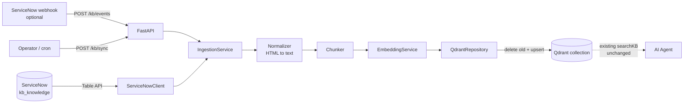

# ServiceNow KB Sync

A standalone service for the **BARQ ServiceNow AI Support Assistant**. It keeps a Qdrant collection
in sync with ServiceNow Knowledge Base articles, so the existing AI Agent can find new and updated
articles through its existing `searchKB(query)` without any change to the Agent.

> This project is **fully independent**: it imports nothing from the Agent, and the Agent imports
> nothing from it. They only share a Qdrant collection (see [Integration contract](#integration-contract)).

## Contents

1. [What it does](#what-it-does) · 2. [Architecture](#architecture) · 3. [Installation](#installation-with-uv)
4. [Environment variables](#environment-variables) · 5. [Run](#run) · 6. [Test](#test)
7. [API](#api-endpoints) · 8. [How synchronization works](#how-synchronization-works)
9. [Qdrant payload](#qdrant-metadata-structure) · 10. [Examples](#example-requests)
11. [Integration contract](#integration-contract) · 12. [Limitations](#known-limitations)

## What it does

- Fetches knowledge articles from ServiceNow (Table API on `kb_knowledge`).
- Cleans HTML → plain text, chunks it, embeds the chunks, and upserts them into Qdrant.
- Handles **new**, **updated**, and **unpublished/deleted** articles.
- Is **idempotent**: re-syncing the same article never creates duplicate vectors.
- Isolates failures: one bad article never aborts a batch.
- Exposes manual, single-article, and (optional) webhook-driven sync, plus a health endpoint.

## Architecture



```
app/
├── main.py            FastAPI app factory
├── config.py          Validated settings (env vars)
├── container.py       Wires services together
├── exceptions.py      Typed errors
├── logging_config.py  Logging with secret redaction
├── api/routes.py      HTTP endpoints
├── models/knowledge.py  KnowledgeArticle, Chunk, API/result schemas
└── services/
    ├── servicenow.py  ServiceNow client + parsing (all ServiceNow specifics live here)
    ├── normalizer.py  HTML -> clean text
    ├── sections.py    Splits article HTML into Problem/Cause/Resolution/... sections
    ├── chunker.py     Deterministic chunking with overlap
    ├── embedder.py    EmbeddingService interface + OpenAI-compatible implementation
    ├── qdrant.py      Repository: deterministic IDs, delete/upsert/exists
    ├── ingestion.py   Orchestration + per-article failure isolation
    └── state.py       Last-successful-sync watermark
```

## Installation with `uv`

Requires Python ≥ 3.11 and [uv](https://docs.astral.sh/uv/).

```bash
cd service-now-kb-sync
uv sync            # creates .venv and installs runtime + dev dependencies
```

## Environment variables

```bash
cp .env.example .env     # then fill in the values; .env is git-ignored
```

| Variable | Required | Description |
|---|---|---|
| `SERVICE_NOW_URL` | ✅ | Instance base URL, e.g. `https://<instance>.service-now.com` |
| `SERVICE_NOW_USERNAME` / `SERVICE_NOW_PASSWORD` | ✅ | Integration user (read access to `kb_knowledge`) |
| `QDRANT_URL` | ✅ | Qdrant endpoint |
| `QDRANT_API_KEY` | | Qdrant API key (omit for unsecured local Qdrant) |
| `QDRANT_COLLECTION` | ✅ | Collection the Agent's `searchKB` reads |
| `EMBEDDING_API_KEY` | ✅ | Embedding provider key |
| `EMBEDDING_MODEL` | ✅ | Must be the **same model** the Agent uses for queries |
| `EMBEDDING_DIMENSION` | ✅ | Must equal the model output size **and** the collection's vector size |
| `CHUNK_SIZE` / `CHUNK_OVERLAP` | | Characters; defaults `500` / `50` (overlap must be < size) |
| `SERVICE_NOW_PUBLISHED_STATES` | | Comma-separated `workflow_state` values meaning "published" (default `published`) |
| `SERVICE_NOW_KB_SYS_IDS` | | Restrict to specific knowledge bases (default: all) |
| `SERVICE_NOW_TABLE` | | Default `kb_knowledge` |
| `QDRANT_TEXT_FIELD` | | Payload key for chunk text (default `text`) — match what `searchKB` reads |
| `QDRANT_VECTOR_NAME` | | Only if the collection uses a *named* vector |
| `QDRANT_DISTANCE` | | `Cosine` (default), `Dot`, `Euclid` — only used when creating a collection |
| `EMBEDDING_INCLUDE_TITLE` | | Prefix each chunk with the article title when embedding (default `true`) |
| `EMBEDDING_BASE_URL` | | OpenAI-compatible endpoint (default `https://api.openai.com/v1`) |
| `API_AUTH_TOKEN` | | If set, `/kb/sync*` require header `X-API-Key` |
| `WEBHOOK_SECRET` | | If set, enables `POST /kb/events` (header `X-Webhook-Secret`) |
| `SYNC_STATE_PATH` | | Watermark file (default `.state/last_sync.json`; mount a volume in containers) |
| `SYNC_INITIAL_LOOKBACK_HOURS` | | Window for the very first non-`full` sync (default 24) |
| `LOG_LEVEL` | | Default `INFO` |

Configuration is validated at startup; the service refuses to start with a clear error if anything
is missing or inconsistent. Secrets are never logged.

## Run

```bash
uv run uvicorn app.main:create_app --factory --host 0.0.0.0 --port 8000
```

(`--factory` keeps configuration loading out of import time.)

## Test

```bash
uv run pytest            # no real credentials or network needed
uv run ruff check . && uv run ruff format --check .
```

Tests mock ServiceNow (`httpx.MockTransport`) and the embedding provider, and run the Qdrant logic
against qdrant-client's real in-memory engine.

## API endpoints

| Method & path | Purpose |
|---|---|
| `GET /health` | Liveness: `{"status":"ok"}`. `?deep=true` also probes Qdrant and ServiceNow (HTTP 503 + `"degraded"` if either fails) |
| `POST /kb/sync` | Sync articles changed since a timestamp. Optional body `{"since": "<ISO-8601>", "full": false}` |
| `POST /kb/sync/{sys_id}` | Sync one article |
| `POST /kb/events` | Optional webhook (`{"sys_id": "..."}`); returns `202` and syncs in the background. Disabled unless `WEBHOOK_SECRET` is set |

`/kb/sync` response:

```json
{"status": "completed", "processed": 5, "created": 2, "updated": 2, "deleted": 1,
 "skipped": 0, "failed": 0, "since": "2026-10-02T08:00:00Z", "failures": []}
```

`status` is `completed_with_errors` if any article failed; `failures` lists `sys_id`, `number`, and
`error` for each. `/kb/sync/{sys_id}` returns `{"status":"success","sys_id":"…","chunks":4,…}`
(HTTP 502 with `"status":"failed"` and an `error` on failure).

## How synchronization works

For each article: **fetch → normalize → chunk → embed → (delete old chunks) → upsert.**

**Choosing what to sync (`POST /kb/sync`)**
- With `{"since": ...}` – that window only (the saved watermark is untouched).
- With `{"full": true}` – every article (use this for the **initial backfill**).
- With no body – everything changed since the last fully successful sync, or the last
  `SYNC_INITIAL_LOOKBACK_HOURS` if there is none. The watermark moves forward only when **zero**
  articles failed (minus a 60 s safety margin for clock skew), so failures are retried next run.
  Re-processing is always safe because syncing is idempotent.

**New articles** – published article, nothing in Qdrant for its `sys_id` → chunks are embedded and
upserted (`action: created`).

**Updated articles** – article already in Qdrant → all its old chunks are **deleted** and the new
chunks are upserted (`action: updated`). Chunks are never merely appended, so a shorter article
cannot leave stale trailing chunks behind. Embeddings are generated *before* the delete, so an
embedding-provider outage cannot leave an article half-removed.

**Unpublished / deleted articles** – if the article is not published (its `workflow_state` isn't in
`SERVICE_NOW_PUBLISHED_STATES`, or `active` is false), or it has no indexable text, or ServiceNow
returns 404 for it, its vectors are deleted (`action: deleted`, or `skipped` if nothing was indexed).
The modified-since query intentionally includes *all* states for this reason.

**Idempotency** – point IDs are deterministic: `UUIDv5(namespace, "{sys_id}:{chunk_index}")`. Syncing
the same article twice yields the same IDs and the same point count.

**Failure isolation** – each article is processed independently; failures are reported in the
summary and logged, never silently swallowed.

**Concurrency** – a lock serializes the delete+upsert step so overlapping runs (API + webhook)
can't interleave.

## Qdrant metadata structure

One point per chunk:

```json
{
  "id": "<uuid5 of sys_id:chunk_index>",
  "vector": [ ... EMBEDDING_DIMENSION floats ... ],
  "payload": {
    "sys_id": "abc123",
    "number": "KB001500",
    "title": "VPN Authentication Issue",
    "chunk_index": 0,
    "chunk_count": 4,
    "source": "servicenow",
    "workflow_state": "published",
    "updated_on": "2026-10-01T12:30:00+00:00",
    "text": "…chunk text…"
  }
}
```

For compatibility with the existing Agent's `searchKB` (which reads `article_id`, `section`,
`chunk_index`, `text`, `category` and builds citations such as `KB0000007#chunk-5`), each point also
carries `article_id` (the KB number), `section` (`"Body"`), `category` (`""`), `short_description`,
`kb_knowledge_base` and `sys_updated_on`.

The text key is configurable via `QDRANT_TEXT_FIELD`. A keyword payload index on `sys_id` is created
automatically on server Qdrant. Each chunk is embedded as `"{title}\n\n{chunk}"` (the stored text is
the chunk only); disable the title prefix with `EMBEDDING_INCLUDE_TITLE=false`.

Article bodies are split into **sections** the same way the Agent's own KB ingestion does: a bold
label (`Problem`, `Symptoms`, `Cause`, `Diagnostic Steps`, `Resolution`, `Workaround`) starts a new
section, text before the first label is `Body`, and unlabeled articles are a single `Body` section.
`chunk_index` runs across the whole article. Content outside `<p>` tags (lists etc.) is kept.

Chunking is character-based: it prefers paragraph, then sentence, then word boundaries, and
consecutive chunks overlap by up to `CHUNK_OVERLAP` characters.

## Example requests

```bash
curl localhost:8000/health
curl "localhost:8000/health?deep=true"

# one article
curl -X POST localhost:8000/kb/sync/<sys_id>

# changed since last successful sync
curl -X POST localhost:8000/kb/sync

# explicit window / initial backfill
curl -X POST localhost:8000/kb/sync -H 'content-type: application/json' \
     -d '{"since": "2026-10-01T00:00:00Z"}'
curl -X POST localhost:8000/kb/sync -H 'content-type: application/json' -d '{"full": true}'

# with API_AUTH_TOKEN set
curl -X POST localhost:8000/kb/sync -H "X-API-Key: $API_AUTH_TOKEN"

# webhook (WEBHOOK_SECRET set)
curl -X POST localhost:8000/kb/events -H "X-Webhook-Secret: $WEBHOOK_SECRET" \
     -H 'content-type: application/json' -d '{"sys_id": "<sys_id>"}'
```

To run on a schedule without webhooks, call `POST /kb/sync` from cron/Kubernetes CronJob every few
minutes. To use webhooks, add a ServiceNow Business Rule on `kb_knowledge` (after insert/update) that
sends a REST message to `/kb/events`; manual sync keeps working regardless.

## Integration contract

**The Agent needs no changes.** This service guarantees only one thing:

> The configured Qdrant collection contains current, correctly embedded chunks of every *published*
> ServiceNow knowledge article, and none from unpublished ones.

For `searchKB(query)` to find synced articles, these must match the Agent's existing setup
(verify before the first run):

| Item | Setting here | Must equal |
|---|---|---|
| Collection | `QDRANT_COLLECTION` | Collection `searchKB` queries |
| Embedding model | `EMBEDDING_MODEL` | Model used to embed queries in the Agent |
| Vector size | `EMBEDDING_DIMENSION` | Collection vector size (checked on first use; a mismatch fails clearly) |
| Distance | `QDRANT_DISTANCE` | Collection distance (only used when *creating* the collection) |
| Text payload key | `QDRANT_TEXT_FIELD` | Key `searchKB` reads for passage text |
| Vector name | `QDRANT_VECTOR_NAME` | Named vector, if the collection uses one |

If the collection already holds KB chunks from an older ingestion process, they are replaced
automatically **as long as they carry the ServiceNow `sys_id` in the payload**: the first sync of an
article deletes every point with that `sys_id` (whatever its point ID) and writes the new chunks.
Points without a matching `sys_id` are never touched (e.g. PDF-sourced chunks). Chunks the old process stored under other `section`s are replaced too, and the new
chunks use the same section names.

## Known limitations

- **Hard-deleted ServiceNow records** don't appear in "modified since" queries. They are removed
  only when synced individually (404 → delete). A periodic reconcile job (compare published
  `sys_id`s with Qdrant) is a natural follow-up.
- **Time-based expiry** (`valid_to`) changes visibility without changing `sys_updated_on`; it isn't
  detected.
- ServiceNow `sys_updated_on` is treated as UTC (Table API default with `sysparm_display_value=false`).
- User-criteria/ACL visibility is not modeled: the integration user's read access defines what is indexed.
- Payload indexes are no-ops in qdrant-client's in-memory mode (tests only); the warning is harmless.
